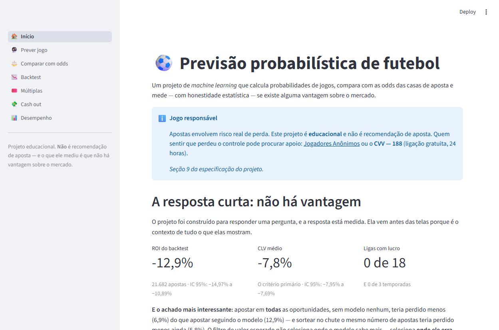
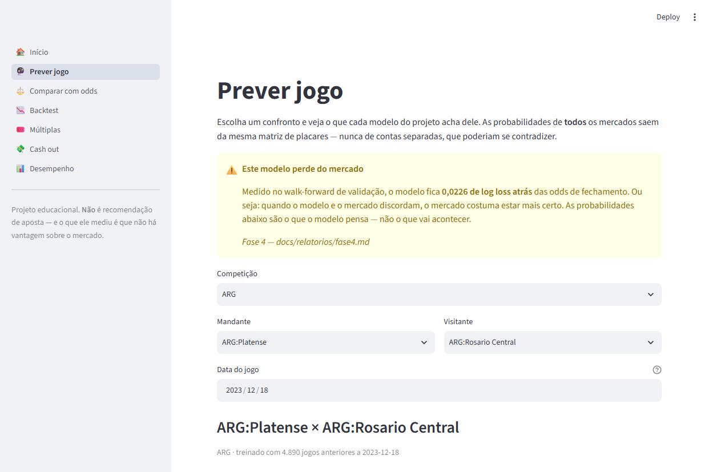

# Previsão Probabilística de Futebol

Projeto de machine learning que calcula probabilidades de jogos de futebol, compara essas
probabilidades com as odds das casas de aposta e faz um **backtest honesto** para medir se
existe (ou não) vantagem sobre o mercado.

> **Projeto educacional.** A hipótese de partida é que **não existe vantagem** sobre as casas.
> O projeto só conclui o contrário com evidência estatística forte — e a análise foi desenhada
> justamente para não se enganar sozinha.

---

## A resposta: não há vantagem, e está medida

O projeto terminou. O [teste final](docs/relatorios/final.md) abriu, **uma única vez**,
duas temporadas que estiveram trancadas desde o começo — 24.779 jogos que nenhum modelo
viu e que nenhum parâmetro foi escolhido olhando.

| | Teste final (2024/25 e 2025/26) | Validação (2021–24) |
|---|---|---|
| **CLV** *(o critério que decide)* | **−9,02%** (IC −9,18% a −8,85%) | −7,82% |
| **ROI** | **−14,41%** (IC −17,00% a −11,80%) | −12,92% |
| Apostar em **tudo**, sem modelo | −7,41% | −6,88% |
| Distância do mercado (log loss) | **+0,0212** | +0,0226 |
| Ligas com CLV positivo | 0 de 18 | 0 de 18 |

**Veredito:** falharam os critérios primários 1 e 2 do critério de parada. O modelo **não
tem vantagem demonstrável** sobre as casas. Com 13.163 apostas — o dobro do mínimo que o
projeto exigiu de si mesmo —, a conclusão é "não há vantagem", e não "faltou amostra".

E o achado que interessa mais que o veredito: **o modelo não piorou fora da amostra.**
Ficou a 0,0212 de log loss do mercado, contra 0,0226 na validação. Ele é exatamente o que
sempre foi — e o que sempre foi é pior que o mercado. Uma distância muito *menor* ali teria
exigido procurar vazamento, não comemorar.

> **Por que isso é o produto e não o fracasso.** Havia caminhos fáceis para um resultado
> bonito: apostar na odd máxima, varrer parâmetros até o backtest fechar no azul, escolher a
> liga e o período que deram certo, ou simplesmente não separar um teste final. O valor deste
> repositório é a máquina que impediu cada um deles.

---

## O que o projeto faz

1. Baixa resultados históricos e odds de **38 competições** do football-data.co.uk.
2. Treina modelos estatísticos (Poisson, Dixon-Coles, Elo, LightGBM) que estimam a
   probabilidade de cada resultado.
3. Compara com a probabilidade implícita nas odds, descontando a margem da casa.
4. Simula apostas em temporadas passadas com validação *walk-forward* (sem olhar o futuro).
5. Mede o efeito das **apostas múltiplas** e do **cash out**.
6. Mostra tudo num app web (Streamlit).

---

## Estado atual

| Fase | Descrição | Situação |
|---|---|---|
| 0 | Configuração do ambiente | ✅ concluída |
| 1 | Coleta e limpeza de dados | ✅ concluída |
| 2 | Análise exploratória e o "mercado" | ✅ concluída |
| 3 | Modelos de Poisson e Dixon-Coles | ✅ concluída |
| 4 | Avaliação honesta (walk-forward) | ✅ concluída |
| 5 | Features e machine learning | ✅ concluída |
| 6 | Backtest de apostas | ✅ concluída |
| 7 | Múltiplas e cash out | ✅ concluída |
| 8 | Aplicativo Streamlit | ✅ concluída |
| 9 | Teste final | ✅ **concluída** |
| 10 | Notícias e desfalques | ✅ concluída |

---

## Instalação

Requer **Python 3.11+** e **Git**.

```powershell
# 1. Criar o ambiente virtual
py -3 -m venv .venv

# 2. Ativar (Windows / PowerShell)
.venv\Scripts\Activate.ps1

# 3. Instalar o projeto em modo editável
pip install -e ".[dev]"

# 4. Conferir que está tudo certo
pytest
```

No Mac/Linux, troque o passo 2 por `source .venv/bin/activate`.

Os guias completos, escritos para quem nunca programou:
[Fase 0 — preparar o computador](docs/guias/GUIA_FASE_0.md),
[Fase 1 — trazer os jogos para dentro do projeto](docs/guias/GUIA_FASE_1.md),
[Fase 2 — medindo o adversário](docs/guias/GUIA_FASE_2.md),
[Fase 3 — o primeiro modelo](docs/guias/GUIA_FASE_3.md),
[Fase 4 — a hora da verdade](docs/guias/GUIA_FASE_4.md) e
[Fase 5 — quando a resposta é "não"](docs/guias/GUIA_FASE_5.md),
[Fase 6 — teria dado lucro?](docs/guias/GUIA_FASE_6.md),
[Fase 7 — por que a casa adora múltiplas](docs/guias/GUIA_FASE_7.md) e
[Fase 8 — o aplicativo](docs/guias/GUIA_FASE_8.md) e
[Fase 9 — o teste final](docs/guias/GUIA_FASE_9.md) e
[Fase 10 — desfalques e notícias](docs/guias/GUIA_FASE_10.md).

---

## Comandos

| O que faz | Comando |
|---|---|
| Rodar os testes | `pytest` |
| Verificar o estilo do código | `ruff check .` |
| Corrigir o estilo automaticamente | `ruff check . --fix` |
| Baixar os dados | `python scripts/baixar_dados.py` |
| Conferir o disco contra o manifesto | `python scripts/baixar_dados.py --conferir` |
| Montar a tabela de jogos | `python scripts/preparar_dados.py` |
| Gerar o relatório de cobertura | `python scripts/relatorio_cobertura.py` |
| Escolher as ligas por qualidade de mercado | `python scripts/filtro_ligas.py` |
| Gerar o relatório da Fase 2 | `python scripts/relatorio_fase2.py` |
| Prever um jogo | `python scripts/prever.py --mandante "Arsenal" --visitante "Chelsea"` |
| Gerar o relatório da Fase 3 | `python scripts/relatorio_fase3.py` |
| Validar e escolher o modelo | `python scripts/validar.py` |
| Gerar o relatório da Fase 4 | `python scripts/relatorio_fase4.py` |
| Validar incluindo o LightGBM | `python scripts/validar.py --com-gbm` |
| Gerar o relatório da Fase 5 | `python scripts/relatorio_fase5.py` |
| Rodar o backtest | `python scripts/backtest.py` |
| Gerar o relatório da Fase 6 | `python scripts/relatorio_fase6.py` |
| Gerar o relatório da Fase 7 | `python scripts/relatorio_fase7.py` |
| Abrir o app | `streamlit run src/futebol/app/streamlit_app.py` |
| **Rodar o teste final** (uma vez!) | `python scripts/teste_final.py` |
| Gerar os dados do app publicado | `python scripts/preparar_deploy.py` |
| Buscar desfalques da rodada | `python scripts/desfalques.py --falso` |
| Ler o caderno do paper trading | `python scripts/desfalques.py --avaliar` |

---

## Dados

**Fonte:** [football-data.co.uk](https://www.football-data.co.uk) — gratuita.

As 38 competições cobertas se dividem em dois grupos com capacidades diferentes:

| Grupo | Competições | Odds disponíveis | Pode apostar? |
|---|---|---|:---:|
| **1** | 22 ligas europeias | pré-jogo **e** fechamento, 1X2 **e** Over/Under | ✅ |
| **2** | 16 países (Brasil, Argentina, EUA, Japão…) | só fechamento de 1X2 | ❌ |

O Grupo 2 entra no **treino e na avaliação de calibração**, mas nunca no backtest de apostas
nem na medição de CLV — não há odd pré-jogo para simular a aposta.

Ao todo são **~117.000 jogos**, dos quais ~53.800 elegíveis para simulação de aposta.

> As pastas `data/raw/` e `data/processed/` **não vão para o Git**. A reprodutibilidade é
> garantida pelo `data/manifesto.json`, que registra URL, data, número de linhas e SHA-256 de
> cada arquivo baixado.

A tabela unificada (`data/processed/jogos.parquet`) guarda cada time como `PAÍS:nome` —
`ENG:Everton` e `CHI:Everton` são clubes diferentes, e juntá-los por engano corromperia as
médias sem dar erro. A cobertura de odds por liga, temporada e mercado está em
[`docs/relatorios/cobertura_fase1.md`](docs/relatorios/cobertura_fase1.md).

---

## O que já foi medido

A [Fase 2](docs/relatorios/fase2.md) mediu o mercado nas 38 competições, e o resultado
define o tamanho do desafio:

| Pergunta | Resposta |
|---|---|
| Quanto a casa cobra? | De **4,3%** (Premier League) a **9,3%** (4ª divisão escocesa) |
| O mercado é bem calibrado? | **Sim** — quando a odd diz 60%, acontece perto de 60% |
| Qual a meta dos modelos? | **Log loss 0,9984**, contra 1,0986 de quem chuta 33% para cada |
| Em quais ligas dá para apostar? | **18 das 22** do Grupo 1, escolhidas por medição |

A vantagem de jogar em casa caiu em **29 das 38 competições** nas temporadas de estádios
vazios (2020-21) — motivo pelo qual o fator casa dos modelos não pode ser uma constante.

A [Fase 3](docs/relatorios/fase3.md) construiu os três primeiros modelos, e a
[Fase 4](docs/relatorios/fase4.md) os mediu do jeito que vale: **walk-forward rodada a
rodada**, reajustando cada modelo antes de cada data em que cada competição jogou. A
[Fase 5](docs/relatorios/fase5.md) pôs um LightGBM com 23 features na mesma disputa.

Todos nas mesmas 36.413 partidas, nenhuma delas do teste final:

| Quem prevê | Log loss (menor é melhor) |
|---|---|
| chute uniforme (33/33/33) | 1,0986 |
| histórico da liga (baseline) | 1,0743 |
| Poisson (ataque, defesa, fator casa) | 1,0272 |
| LightGBM sem o Dixon-Coles de feature | 1,0245 |
| LightGBM completo | 1,0197 |
| **Dixon-Coles (`xi` 0,003) — o modelo do projeto** | **1,0194** |
| mercado de fechamento | **0,9968** |

**O mercado ganha, e isso era o esperado.** A odd de fechamento embute lesão, escalação e
o dinheiro de milhares de apostadores profissionais. A pergunta que interessa não é "meu
modelo bate o mercado em média?", e sim "existe jogo em que o mercado errou mais que eu?" —
que é a pergunta da Fase 6.

**O LightGBM não ganhou, e o projeto não o adotou.** A diferença para o Dixon-Coles é
indistinguível de zero, e tirar as probabilidades do Dixon-Coles das features dele piora
o modelo de verdade — 61% do que ele usa para decidir vem de lá. Ele não descobriu nada
sobre futebol que o modelo de gols não soubesse; redescobriu o modelo de gols, com mais
peças móveis. O código fica no repositório, pronto para a **Fase 10**, quando entrar
informação que o placar não tem — desfalque, escalação, notícia.

---

## O backtest: teria dado lucro?

Não. A [Fase 6](docs/relatorios/fase6.md) simulou **21.682 apostas** nas 18 ligas
aprovadas, entre julho de 2021 e junho de 2024, sempre na odd média pré-jogo:

| | Resultado |
|---|---|
| ROI | **−12,92%** (IC 95%: −14,97% a −10,89%) |
| CLV — o critério primário | **−7,82%** (IC 95%: −7,95% a −7,69%) |
| Ligas com ROI positivo | **0 de 18** |
| Temporadas com ROI positivo | **0 de 3** |
| Menor efeito que a amostra enxerga | 2,03% de ROI — o medido é seis vezes maior |

A amostra é quatro vezes o mínimo exigido, então a conclusão **não** é "amostra
insuficiente": é que não há vantagem, medida com folga.

**O achado da fase é outro, e é mais interessante que o veredito.** Apostar **ao acaso**
entre as mesmas oportunidades dá ROI de −6,88% — quase metade do prejuízo. O filtro de
valor esperado escolhe **pior que o chute**, e dá para explicar por quê: como
`EV = probabilidade × odd − 1` é multiplicativo na odd, um mesmo erro do modelo produz EV
alto no azarão e quase nada no favorito. E o azarão é justamente onde a casa cobra mais
(2% de comissão em odd 1,5, mais de 21% acima de odd 10). Com um modelo atrás do mercado,
o filtro de EV não é um filtro de qualidade — é um **amplificador do erro do modelo**.

---

## Múltiplas: a lupa do erro

A [Fase 7](docs/relatorios/fase7.md) montou **36.211 bilhetes** de 2 a 10 seleções nas
mesmas rodadas, com no máximo uma seleção por jogo:

| Jogos no bilhete | Comissão acumulada da casa | Equivale a, por jogo |
|---|---|---|
| 2 | 9,1% | 4,47% |
| 5 | 24,3% | 4,44% |
| 10 | **54,0%** | 4,41% |

A comissão **por jogo** é constante: o que cresce é o efeito de cobrá-la várias vezes, uma
em cima da outra. Um bilhete de dez jogos custa 1,54 vez o que ele vale, e isso não
depende de modelo nenhum.

**A surpresa da fase foi o que ela *não* encontrou.** A especificação esperava achar
correlação entre jogos — o produto simples das probabilidades superestimando a chance de
bilhetes grandes. Refazendo a conta com as probabilidades justas do mercado, ela
**acerta**: o intervalo de confiança contém o zero nos nove tamanhos. O desvio observado é
outra coisa — é o erro do modelo em **cada seleção** (ele exagera 4,1% por perna) elevado
à potência do tamanho do bilhete, o que dá 28,5% num bilhete de oito. **A múltipla
funciona como uma lupa do erro do modelo.**

E o cash out cobra a mesma taxa não importa quando é apertado: o valor esperado de sacar é
o de não sacar vezes `(1 − taxa)`, para qualquer momento de saque. Isso é uma identidade,
não um achado empírico.

---

## O aplicativo

```powershell
streamlit run src/futebol/app/streamlit_app.py
```

Sete telas: as probabilidades de um confronto, o valor esperado contra as odds
que você digitar, o backtest com a banca ao longo do tempo, o montador de
múltiplas, o valor justo de um cash out e as tabelas de desempenho dos modelos.



*A abertura dá o resultado antes de oferecer a ferramenta.*



*Toda tela que mostra probabilidade carrega o aviso do que foi medido sobre ela.*

⚠️ **O app é a primeira entrega que alguém pode usar sem ler relatório nenhum**, e
isso define o desenho dele. Uma tela que mostra "68% de chance" e "valor esperado
+7%" sem contexto é, na prática, uma recomendação de aposta — e este projeto
mediu, em 21.682 apostas, que seria uma recomendação ruim. Então:

- a **tela de abertura dá o veredito antes da ferramenta**: ROI −12,92%, CLV
  −7,82%, zero de 18 ligas com lucro;
- os avisos moram num **módulo só** (`src/futebol/app/avisos.py`), cada um com o
  número medido e o relatório de onde ele saiu. Há teste que exige cada aviso na
  tela correspondente, e outro que confere os números contra o próprio relatório —
  um aviso apagado numa reescrita derruba o `pytest` em vez de sumir calado;
- **nenhuma métrica aparece sem o intervalo de confiança e o número de apostas**,
  porque o componente que as desenha não sabe desenhar um número sozinho;
- o limite de valor esperado é uma lista dos **quatro que a Fase 6 mediu**, não um
  campo livre — campo livre seria um convite a procurar o número que deixa o
  gráfico bonito.

O app **não tem matemática própria**: todo número vem do mesmo código que gerou os
relatórios, e a tela de desempenho refaz as contas a partir do mesmo cache de
previsões em vez de copiar valores. Tela e documento não têm como discordar.

---

## A última fase: desfalques e notícias

O modelo olha resultados passados e mais nada — ele não sabe que o artilheiro
está lesionado. A [Fase 10](docs/guias/GUIA_FASE_10.md) monta o pipeline que
conta isso a ele: próximos jogos → times alvo → API de lesões → notícias → um
LLM que lê o texto e devolve JSON → peso do jogador → ajuste da força do time.

```powershell
python scripts/desfalques.py --falso   # roda tudo sem chave nenhuma
```

⚠️ **E ela termina sem provar nada, de propósito.** O projeto mediu quanto
precisaria de amostra: com ~150 jogos (seis semanas), a menor melhora de log
loss detectável é **0,0338** — enquanto a distância **inteira** do modelo para o
mercado é **0,0212**. Pela log loss, o ajuste teria de superar o mercado em 60%
só para o efeito aparecer. Não há atalho: a avaliação é para frente (*paper
trading*), leva meses, e enquanto o intervalo de confiança cruzar zero a
resposta é **"ainda não dá para saber"**.

O único uso de IA do projeto está aqui, e a fronteira é estrita: o LLM **lê
texto**, nunca calcula probabilidade. A probabilidade continua saindo do
Dixon-Coles, que é uma conta fechada e auditável.

---

## Como este projeto evita se enganar

Backtest de aposta é um campo minado. Estas regras estão no código, não só na documentação:

- **Sem data leakage.** Previsão para a data D só usa jogos anteriores a D, com teste automatizado.
- **Aposta na odd média, nunca na máxima.** Usar a melhor odd do mercado infla o ROI
  artificialmente — é o erro que invalida a maioria dos backtests amadores.
- **Modelo se escolhe por log loss, nunca por ROI.** ROI é dominado por ruído.
- **Tudo com intervalo de confiança**, mais o número de apostas e o menor efeito detectável
  naquela amostra.
- **CLV é o critério primário.** Como não depende do resultado do jogo, converge com muito
  menos apostas do que o ROI.
- **Teste final aberto uma única vez**, com a configuração pré-registrada antes.
- **Resultado negativo é resultado** e será reportado como tal.

Detalhes em [`PROJETO_PREVISAO_FUTEBOL.md`](PROJETO_PREVISAO_FUTEBOL.md), seções 2.6 e 8.

---

## Estrutura

```
├── config.yaml          # tudo que é ajustável sem mexer em código
├── data/                # dados (fora do Git) + manifesto (no Git)
├── docs/guias/          # guias passo a passo para leigos
├── docs/relatorios/     # resultados de cada fase
├── notebooks/           # análises exploratórias
├── src/futebol/         # o código
├── scripts/             # comandos de linha
└── tests/               # testes automatizados
```

---

## Jogo responsável

Apostas envolvem risco real de perda financeira. Este projeto é **educacional** e não é
recomendação de aposta. Quem sentir que perdeu o controle pode procurar
[Jogadores Anônimos](https://jogadoresanonimos.com.br) ou o **CVV — 188** (ligação gratuita, 24h).

---

## Licença

MIT.
