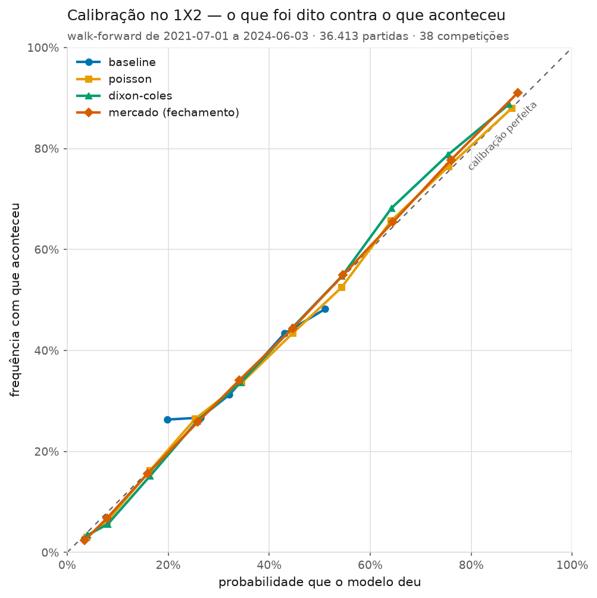
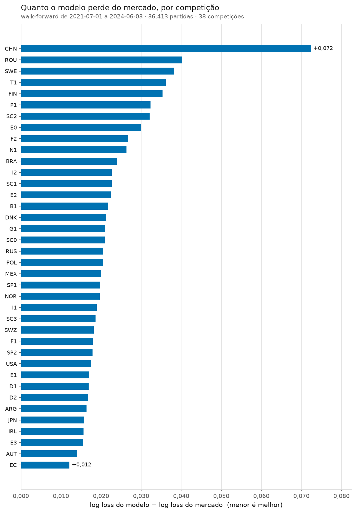

# Fase 4 — A avaliação honesta

- Camada de ligas: **camada_tudo**
- Janela de validação: **2021-07-01 a 2024-06-03**
- Jogos avaliados: **36.413**, cada um previsto por um modelo treinado **só** com o que existia antes da rodada dele
- Jogos trancados até a Fase 9: **27.059** (regra 7)
- Grupo 1 — backtest e CLV (22): B1, D1, D2, E0, E1, E2, E3, EC, F1, F2, G1, I1, I2, N1, P1, SC0, SC1, SC2, SC3, SP1, SP2, T1
- Grupo 2 — treino e calibração (16): ARG, AUT, BRA, CHN, DNK, FIN, IRL, JPN, MEX, NOR, POL, ROU, RUS, SWE, SWZ, USA
- Gerado em: 2026-09-17

> **Regra 13.** Cada tabela diz de quais ligas fala. Onde não estiver
> escrito o contrário, o número é das **38 competições**, Grupo 1 e
> Grupo 2 juntos — o que vale para medir previsão, já que o Grupo 2
> tem odd de fechamento. Aposta é outra história: ali valem só as 18
> ligas aprovadas na Fase 2 (regra 12).

> **Regra 9.** A escolha de modelo desta fase é por **log loss**. Não
> por acurácia, não por calibração, e principalmente não por lucro.

> **Regra 7.** Nada aqui viu as temporadas de teste final. A trava é
> código (`futebol/avaliacao/divisao.py`) e o walk-forward confere,
> linha por linha, que nenhum treino alcançou a partida prevista.

## 1. O que mudou da Fase 3 para cá

A Fase 3 mediu os modelos reajustando cada um **uma vez por mês**. Servia para
experimentar, e o próprio relatório dizia que era provisório. Aqui a medição é a
que vale:

| | Fase 3 (provisória) | Fase 4 (oficial) |
|---|---|---|
| Quando o modelo é retreinado | todo dia 1º | **antes de cada rodada** |
| Quanto a previsão pode estar velha | até 30 dias | zero |
| Para que serve | ver se a ideia funciona | **escolher o modelo** (regra 9) |

"Rodada" aqui é literal: cada data em que uma competição jogou. Para prever o
Arsenal x Chelsea de um sábado, o modelo é estimado com tudo o que aconteceu até
a sexta — e com nada além disso.

Na janela avaliada isso deu **36.446** partidas previstas, com mais de **dez mil** ajustes de modelo por configuração testada — uma competição, uma rodada, um ajuste.

⚠️ **Onde o vazamento entraria, e por que ele não entra.** Um `<=` no lugar de
um `<` bastaria para o modelo treinar com o próprio jogo que está prevendo, e o
resultado ficaria ótimo e falso. Duas travas cuidam disso: o corte de data mora
na classe base dos modelos (nenhum modelo pode esquecê-lo) e o walk-forward
confere, previsão por previsão, que a data do último jogo de treino é **anterior**
à da partida. A conferência roda junto com a medição, não só no `pytest` —
depender de alguém lembrar de rodar o teste seria depender de memória.

E há um teste de **sabotagem**: um modelo que ignora o corte de propósito tem de
ser reprovado. Um teste que só verifica o código certo não prova que a trava
funciona; prova que o código certo passa.

## 2. A tabela da fase: os modelos contra o mercado

As mesmas 36.413 partidas para todo mundo, em
38 competições. Menor é melhor em log loss, Brier e ECE; maior é melhor em
acurácia.

| Quem prevê | Jogos | Log loss (1X2) | Brier | Acurácia | ECE | Log loss (O/U 2,5) |
|---|---|---|---|---|---|---|
| baseline | 36.413 | 1,0743 | 0,6500 | 43,5% | 0,0049 | 0,6881 |
| poisson | 36.413 | 1,0272 | 0,6164 | 48,3% | 0,0108 | 0,6871 |
| dixon-coles | 36.413 | 1,0196 | 0,6111 | 49,0% | 0,0061 | 0,6849 |
| mercado (fechamento) | 36.413 | 0,9968 | 0,5958 | 50,6% | 0,0023 | 0,6736 |

Referência: quem chuta 33% para cada opção tira log loss
**1,0986**.

Três leituras, em ordem de importância:

**1. Cada degrau de modelo é real.** O baseline bate o chute uniforme (sabe a estatística da liga), o Poisson bate o baseline (sabe quem joga) e o Dixon-Coles bate o Poisson (sabe que placar baixo é diferente e que jogo velho vale menos).

**2. O mercado ganha, por 0,0228 de log loss.** Era o esperado — e a especificação já dizia que seria, antes de qualquer conta. A odd de fechamento embute escalação, lesão, suspensão, clima
e o dinheiro de milhares de apostadores profissionais. Um modelo que só lê
placares não deveria vencer isso.

**3. A acurácia atrapalha mais do que ajuda.** Repare que ela varia pouco entre
modelos muito diferentes: é que quase toda previsão de 1X2 aponta o mandante, e
acertar "quem ganha" é uma pergunta grosseira demais para separar um modelo bom
de um medíocre. Ela está na tabela por honestidade, e não entra em nenhuma
decisão (regra 9).

### A calibração

Como ler: a diagonal é a calibração perfeita — "quando digo 60%, acontece 60%".
Ponto **abaixo** da linha é confiança demais (o modelo prometeu mais do que
entregou); **acima**, timidez.

⚠️ Calibração não mede conhecimento. Um modelo que responde sempre "44%, 26%,
30%" (a média da liga) fica quase perfeito nesta curva e não sabe nada sobre
jogo nenhum. Ela serve para outra coisa, e essa coisa é decisiva para apostar: o
valor esperado de uma aposta é calculado **com a probabilidade do modelo**. Se
ela vier inflada, o EV vem inflado junto, e o backtest da Fase 6 apostaria em
valor que não existe.

## 3. A escolha oficial (regra 9)

Disputaram **13 configurações**, todas medidas no mesmo
walk-forward e nos mesmos jogos. Venceu a de menor log loss:

> **dc-xi-0.003** — log loss
> **1,0191**
> Parâmetros: `{'modelo': 'dixon-coles', 'xi': 0.003, 'm': 6.0}`

⚠️ **Este número sai de um conjunto de jogos diferente do das outras tabelas, e
por um motivo.** A escolha de modelo não pode depender de haver odd: ela é medida
na interseção dos **13 candidatos entre si**
(36.446 jogos). Toda tabela que mostra o
**mercado** ao lado dos modelos precisa exigir odd, e cai para
36.413 jogos — é por isso que a mesma configuração
aparece com 1,0194 na seção 4. As duas medidas são
da mesma coisa em amostras diferentes; comparar números **entre** os dois
conjuntos não vale.

A margem sobre a segunda colocada foi de
**0,00022** de log loss. Medida jogo a jogo, com
incerteza:

**+0,00016 (IC 95%: -0,00029 a +0,00061; n = 36.413 jogos; menor efeito detectável nesta amostra: 0,00065) — indistinguível de zero**

⚠️ A escolha **mudou** o que a Fase 3 tinha deixado provisório (`xi` 0,0018, `m` 6). Os valores escolhidos foram gravados no `config.yaml`, e a marca `PROVISORIO` saiu.

⚠️ **Por que log loss, e não lucro.** O ROI de um backtest depende de algumas
centenas de apostas, cada uma valendo 0 ou 1. Nesse tamanho de amostra, a
diferença entre um modelo bom e um modelo **sortudo** é invisível — a Fase 6 vai
mostrar isso com número. A log loss usa as
36.446 partidas e a probabilidade inteira, não
só o que deu certo. Escolher por lucro é escolher o modelo mais sortudo do
passado, e a regra 9 existe para isso não acontecer por descuido.

⚠️ **Por que só 13 configurações** (regra 11). Quanto mais
configurações se testa, maior a chance de a melhor delas estar na frente por
acaso — e uma busca ampla acaba se ajustando à própria validação. A grade é
pequena e definida em código (`futebol/avaliacao/selecao.py`), em torno do que a
literatura e a Fase 3 indicaram. O número acumulado está no pré-registro.

## 4. Os parâmetros que a Fase 3 deixou provisórios

### O decaimento temporal (`xi`)

Cada jogo entra no ajuste com peso `exp(−xi · dias)`. `xi = 0` é um modelo com
memória infinita; `xi` grande é um modelo amnésico.

| xi | Meia-vida | Log loss | Brier | ECE |
|---|---|---|---|---|
| 0,0000 | sem decaimento | 1,0267 | 0,6161 | 0,0077 |
| 0,0005 | 1386 dias | 1,0232 | 0,6136 | 0,0068 |
| 0,0010 | 693 dias | 1,0211 | 0,6122 | 0,0064 |
| 0,0018 | 385 dias | 1,0196 | 0,6111 | 0,0061 |
| 0,0030 | 231 dias | 1,0194 | 0,6110 | 0,0069 |
| 0,0050 | 139 dias | 1,0214 | 0,6123 | 0,0058 |

O fundo da curva está em `xi = 0,0030`
(231 dias). Ter memória curta paga, e paga de forma
mensurável — a diferença entre `xi = 0` e o escolhido, medida jogo a jogo:

**+0,00714 (IC 95%: +0,00599 a +0,00830; n = 36.413 jogos; menor efeito detectável nesta amostra: 0,00165) — diferença real**

### O encolhimento (`jogos_equivalentes`)

Quantos jogos de história "a média da liga" vale, quando se estima a força de um
time. É a resposta ao time recém-promovido, que chega sem nenhum jogo naquela
divisão.

| m | Peso próprio com 10 jogos | Log loss | Brier | ECE |
|---|---|---|---|---|
| 1 | 90,9% | 1,0221 | 0,6126 | 0,0095 |
| 2 | 83,3% | 1,0208 | 0,6119 | 0,0078 |
| 6 | 62,5% | 1,0196 | 0,6111 | 0,0061 |
| 12 | 45,5% | 1,0205 | 0,6116 | 0,0104 |
| 20 | 33,3% | 1,0230 | 0,6133 | 0,0159 |

O fundo está em `m = 6`, e a curva é rasa na
vizinhança — o modelo não é sensível a essa escolha dentro da faixa razoável, o
que é uma boa notícia: significa que não há nada aqui para "otimizar" além do
que já foi feito.

## 5. O fator casa por liga, revisitado

A Fase 3 comparou "um fator casa por competição" com "um fator casa só" e não
conseguiu separar os dois. Ficou prometida uma revisita com o walk-forward
oficial, e aqui está ela. A variante única usa
0,240 — medido com tudo o que existia **antes** do
começo da janela e congelado, para não haver futuro nele.

**+0,00022 (IC 95%: -0,00031 a +0,00075; n = 36.413 jogos; menor efeito detectável nesta amostra: 0,00076) — indistinguível de zero**

Mesmo com amostra três vezes maior e medição rodada a rodada, **a diferença continua indistinguível de zero**. A leitura honesta é *não dá para dizer qual é melhor por este critério* — e não *são iguais*.

De qualquer forma, o projeto segue com o fator casa **por liga**, pelos mesmos
motivos da Fase 3, que não dependem deste teste: o fator casa vai de 1,10 na
Áustria a 1,50 nos Estados Unidos, e aplicar a vantagem de casa de um país ao
outro é errado por razão física — viagem, altitude, público —, não estatística.
Um parâmetro a mais por competição, com milhares de jogos para estimá-lo, não é
o tipo de coisa que causa sobreajuste.

## 6. Onde o modelo chega perto do mercado

A média não decide nada: aposta se faz jogo a jogo, e só onde a diferença entre
o modelo e o mercado é pequena pode existir valor. Esta é a seção que a Fase 6
vai usar.

As competições em que o modelo fica **mais perto** do mercado:

| Liga | Jogos | Log loss do modelo | Log loss do mercado | Distância | Aprovada p/ aposta |
|---|---|---|---|---|---|
| EC | 1.610 | 1,0163 | 1,0043 | 0,0121 | não |
| AUT | 585 | 1,0099 | 0,9958 | 0,0141 | não |
| E3 | 1.656 | 1,0605 | 1,0450 | 0,0155 | sim |
| IRL | 458 | 0,9755 | 0,9599 | 0,0156 | não |
| JPN | 803 | 1,0588 | 1,0431 | 0,0158 | não |
| ARG | 1.488 | 1,0680 | 1,0516 | 0,0164 | não |
| D2 | 918 | 1,0452 | 1,0284 | 0,0168 | sim |
| D1 | 918 | 0,9916 | 0,9747 | 0,0169 | sim |

E as em que ele fica mais longe:

| Liga | Jogos | Log loss do modelo | Log loss do mercado | Distância | Aprovada p/ aposta |
|---|---|---|---|---|---|
| FIN | 442 | 1,0191 | 0,9838 | 0,0354 | não |
| T1 | 1.073 | 1,0010 | 0,9648 | 0,0362 | sim |
| SWE | 659 | 0,9990 | 0,9608 | 0,0382 | não |
| ROU | 962 | 1,0133 | 0,9730 | 0,0402 | não |
| CHN | 684 | 0,9471 | 0,8747 | 0,0724 | não |

A coluna "aprovada p/ aposta" vem do filtro de qualidade de mercado da Fase 2:
são as 18 ligas do Grupo 1 com margem, cobertura e calibração
aceitáveis. ⚠️ **Estar perto do mercado numa liga não aprovada não serve para
nada** — sem odd pré-jogo não há aposta a simular (regra 12), e é o caso de todas
as competições do Grupo 2.

Em nenhuma competição o modelo bateu o mercado — o que é o resultado normal e esperado.

## 7. O que esta fase não responde

- **não há nenhuma aposta aqui.** Nem ROI, nem CLV, nem valor esperado. Saber
  prever melhor que antes não é o mesmo que ganhar dinheiro: entre uma coisa e
  outra está a margem da casa, medida na Fase 2, que é de 4,3% a 8% nas ligas
  aprovadas. O modelo precisa ser melhor que o mercado **por mais que isso** num
  jogo específico para a aposta ter valor;
- **o teste final continua fechado** (regra 7). Estas
  36.446 partidas são de validação; as duas
  temporadas mais recentes serão abertas uma única vez, na Fase 9;
- **nenhuma informação além de placar.** Elo, forma recente, dias de descanso e
  desfalques entram nas Fases 5 e 7. O que está medido aqui é o teto do que se
  consegue só com o placar dos jogos anteriores;
- **o modelo não sabe nada sobre o jogo específico.** Ele não sabe que o
  goleiro titular está suspenso nem que o time joga a final da Champions na
  quarta. O mercado sabe, e parte da diferença de log loss é exatamente isso.

## Pré-registro (regra 11)

Para a Fase 9 abrir o teste final uma única vez, o que foi escolhido precisa
estar escrito **antes**:

| | |
|---|---|
| Configurações testadas na validação | **13** (Fase 4) + 13 exploratórias na Fase 3 |
| Configuração escolhida | `{'modelo': 'dixon-coles', 'xi': 0.003, 'm': 6.0}` |
| Critério | log loss no walk-forward de validação (regra 9) |
| Janela de validação | 36.446 partidas, nenhuma do teste final |
| Data | 2026-09-17 |

Este quadro está repetido no `CLAUDE.md`, que é onde ele vale como registro. Se
as Fases 5, 6 ou 7 mudarem a escolha, o número de configurações testadas **sobe**
e o pré-registro é reescrito — nunca apagado.
