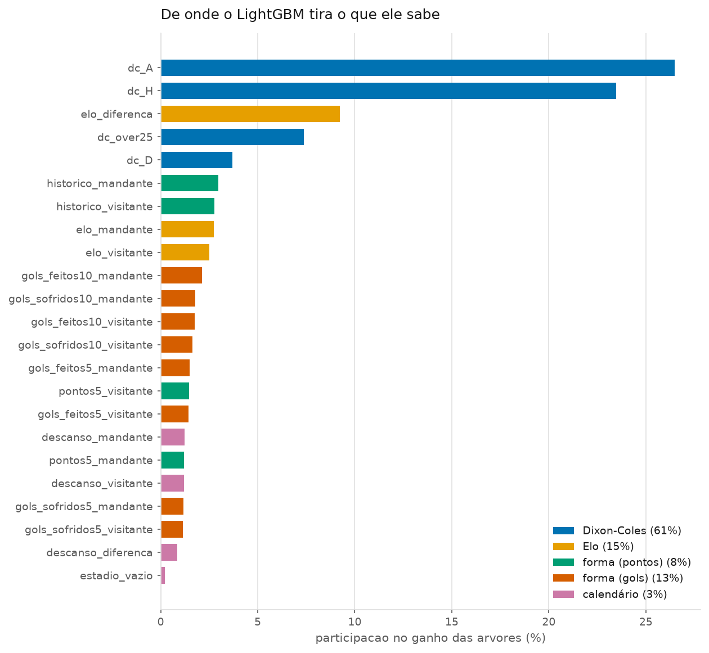

# Fase 5 — Features e machine learning

- Camada de ligas: **camada_tudo**
- Janela de validação: **2021-07-01 a 2024-06-03** — a mesma da Fase 4
- Jogos avaliados: **36.413**, os mesmos para todos os modelos
- Grupo 1 — backtest e CLV (22): B1, D1, D2, E0, E1, E2, E3, EC, F1, F2, G1, I1, I2, N1, P1, SC0, SC1, SC2, SC3, SP1, SP2, T1
- Grupo 2 — treino e calibração (16): ARG, AUT, BRA, CHN, DNK, FIN, IRL, JPN, MEX, NOR, POL, ROU, RUS, SWE, SWZ, USA
- Gerado em: 2026-09-17

> **Regra 13.** Onde não estiver escrito o contrário, o número é das
> **38 competições**. Aposta é outra história: ali
> valem só as 18 ligas aprovadas na Fase 2 (regra 12).

> **Regra 9.** A escolha continua sendo por **log loss** no walk-forward de
> validação. Um modelo novo não entra por ser novo, nem por ser sofisticado.

> **Regra 11.** As três configurações desta fase **somam** às 26 anteriores.
> Toda configuração testada é uma chance a mais de a melhor estar na frente por
> acaso, e é por isso que elas são contadas.

## A resposta, primeiro

A pergunta da fase era: **dar ao modelo vinte e três informações em vez de só os
placares faz ele prever melhor?**

A resposta medida é **não** — e, mais exatamente, *não deu para distinguir*. O
melhor LightGBM (`gbm-raso`, log loss
1,0195) ficou atrás do campeão da Fase 4
(`dc-xi-0.003`, 1,0194), e a diferença
entre os dois, medida jogo a jogo:

**+0,00013 (IC 95%: -0,00075 a +0,00102; n = 36.413 jogos; menor efeito detectável nesta amostra: 0,00126) — indistinguível de zero**

Então o modelo do projeto **não muda**. O `config.yaml` continua como a Fase 4 o
deixou, e o LightGBM fica no repositório como o que ele é: uma hipótese que foi
testada direito e não se sustentou.

⚠️ **Isso não é um fracasso da fase; é o produto dela.** Uma fase que só
pudesse terminar em "sim" não seria uma medição, seria uma encenação. O que se
comprou aqui foi a informação de que a complexidade não paga — e o direito de
não carregá-la nas Fases 6 a 9.

## A tabela da Fase 4, atualizada

Todos medidos nas mesmas partidas. Menor é melhor em log loss, Brier e ECE.

| Quem prevê | Fase | Jogos | Log loss (1X2) | Brier | Acurácia | ECE |
|---|---|---|---|---|---|---|
| mercado (fechamento) | — | 36.413 | 0,9968 | 0,5958 | 50,6% | 0,0023 |
| dc-xi-0.003 | 4 | 36.413 | 1,0194 | 0,6110 | 49,0% | 0,0069 |
| gbm-raso | 5 | 36.413 | 1,0195 | 0,6110 | 48,8% | 0,0105 |
| dixon-coles | 4 | 36.413 | 1,0196 | 0,6111 | 49,0% | 0,0061 |
| gbm | 5 | 36.413 | 1,0197 | 0,6111 | 48,8% | 0,0110 |
| dc-casa-unica | 4 | 36.413 | 1,0198 | 0,6113 | 48,9% | 0,0067 |
| dc-m-12 | 4 | 36.413 | 1,0205 | 0,6116 | 49,1% | 0,0104 |
| dc-m-2 | 4 | 36.413 | 1,0208 | 0,6119 | 48,8% | 0,0078 |
| dc-xi-0.001 | 4 | 36.413 | 1,0211 | 0,6122 | 48,7% | 0,0064 |
| dc-xi-0.005 | 4 | 36.413 | 1,0214 | 0,6123 | 48,9% | 0,0058 |
| dc-m-1 | 4 | 36.413 | 1,0221 | 0,6126 | 48,8% | 0,0095 |
| dc-m-20 | 4 | 36.413 | 1,0230 | 0,6133 | 49,0% | 0,0159 |
| dc-xi-0.0005 | 4 | 36.413 | 1,0232 | 0,6136 | 48,5% | 0,0068 |
| gbm-sem-dc | 5 | 36.413 | 1,0245 | 0,6145 | 48,5% | 0,0123 |
| dc-xi-0.0 | 4 | 36.413 | 1,0267 | 0,6161 | 48,2% | 0,0077 |
| poisson | 4 | 36.413 | 1,0272 | 0,6164 | 48,3% | 0,0108 |
| baseline | 4 | 36.413 | 1,0743 | 0,6500 | 43,5% | 0,0049 |

Duas coisas que a tabela mostra e que vale dizer em voz alta:

**1. O LightGBM entrou no meio do pelotão do Dixon-Coles, não acima dele.** As
variantes `gbm` e `gbm-raso` caíram exatamente na faixa em que já estavam as
variações de `xi` do modelo de gols — ou seja, onde nada é distinguível de nada.

**2. A calibração do LightGBM é pior.** O ECE dele é cerca do dobro do
Dixon-Coles. Faz sentido: uma árvore prevê por médias de grupos de jogos
parecidos, e nas pontas ela extrapola mal. Isso importaria muito se ele fosse o
escolhido, porque o valor esperado de uma aposta é calculado **com a
probabilidade do modelo** — probabilidade inflada vira aposta que não existe. A
especificação previa calibrar (isotônica ou Platt) "se necessário"; como o
modelo não entrou, calibrá-lo seria trabalho para melhorar algo que não vai ser
usado, e **cada** variante calibrada custaria mais uma configuração na regra 11.

## As quatro perguntas, com incerteza

Ordenar uma tabela não responde nada: com 36 mil jogos, diferença de log loss
abaixo de ~0,0015 não é mensurável. Cada linha abaixo é a diferença **emparelhada
jogo a jogo**, com intervalo de confiança e o menor efeito que a amostra
conseguiria detectar (regra 10).

**O LightGBM completo bate o Dixon-Coles com o mesmo `xi`?**

`dixon-coles` contra `gbm`:

> +0,00012 (IC 95%: -0,00092 a +0,00116; n = 36.413 jogos; menor efeito detectável nesta amostra: 0,00148) — indistinguível de zero

**E a variante regularizada, contra o campeão?**

`dc-xi-0.003` contra `gbm-raso`:

> +0,00013 (IC 95%: -0,00075 a +0,00102; n = 36.413 jogos; menor efeito detectável nesta amostra: 0,00126) — indistinguível de zero

**Quanto vale entregar o Dixon-Coles de bandeja ao LightGBM?**

`gbm` contra `gbm-sem-dc`:

> +0,00485 (IC 95%: +0,00379 a +0,00591; n = 36.413 jogos; menor efeito detectável nesta amostra: 0,00152) — diferença real

**As dezenove features, sozinhas, valem mais que um Poisson?**

`gbm-sem-dc` contra `poisson`:

> +0,00270 (IC 95%: +0,00068 a +0,00473; n = 36.413 jogos; menor efeito detectável nesta amostra: 0,00289) — diferença real

**A leitura conjunta.** As duas primeiras perguntas dão empate técnico: o
LightGBM não é melhor nem pior que o modelo de gols, e a amostra não consegue
separá-los. As duas últimas, sim, dão diferença real — e é nelas que está o
aprendizado da fase:

- tirar o Dixon-Coles das features **piora muito** o LightGBM. Quase todo o
  conhecimento dele vem de lá;
- mas as outras features não são inúteis: sozinhas, elas batem o Poisson. Elas
  têm sinal — só não têm sinal **além** do que o Dixon-Coles já capturou.

⚠️ **A quarta comparação pede uma ressalva, e ela ensina uma coisa de
estatística que vale carregar para as próximas fases.** Repare que ali o efeito
medido é **menor** que o "menor efeito detectável", e mesmo assim o intervalo de
confiança não cruza o zero. Os dois números não se contradizem porque respondem a
perguntas diferentes: o intervalo usa 1,96 erros-padrão e pergunta *este efeito
apareceu?*; o menor efeito detectável usa 2,8 e pergunta *esta amostra teria 80%
de chance de enxergar um efeito deste tamanho, se ele existisse?*. Aqui a
resposta é "apareceu, mas a amostra teria boa chance de não ter visto". É um
achado **frágil**: sustenta dizer que as features têm algum sinal, e não sustenta
nenhuma afirmação sobre o tamanho desse sinal.

Ou seja: o LightGBM não descobriu nada sobre futebol que o modelo de gols não
soubesse. Ele redescobriu o modelo de gols, com mais peças móveis.

## De onde o LightGBM tira o que ele sabe

Somando por família de feature:

| Família | Participação no ganho |
|---|---|
| Dixon-Coles | 61,1% |
| Elo | 14,5% |
| forma (gols) | 12,6% |
| forma (pontos) | 8,4% |
| calendário | 3,5% |

E as oito colunas mais usadas, com o que cada uma quer dizer:

| Feature | Ganho | O que é |
|---|---|---|
| `dc_A` | 26,5% | chance de vitória do visitante, segundo o Dixon-Coles |
| `dc_H` | 23,5% | chance de vitória do mandante, segundo o Dixon-Coles |
| `elo_diferenca` | 9,2% | quanto o mandante é melhor que o visitante, em pontos de Elo |
| `dc_over25` | 7,4% | chance de sair mais de 2,5 gols, segundo o Dixon-Coles |
| `dc_D` | 3,7% | chance de empate, segundo o Dixon-Coles |
| `historico_mandante` | 3,0% | quantos jogos o mandante já tem de história |
| `historico_visitante` | 2,8% | quantos jogos o visitante já tem de história |
| `elo_mandante` | 2,8% | rating Elo do mandante antes do jogo |

⚠️ **Importância não é utilidade, e a confusão entre as duas é a armadilha mais
comum quando se olha um gráfico desses.** O "ganho" mede quanto as divisões
naquela coluna reduziram o erro **dentro do treino**. Uma coluna contínua e cheia
de valores distintos dá à árvore muitos lugares onde cortar e aparece alto por
isso; e duas colunas que dizem a mesma coisa dividem o crédito, de modo que
importância baixa pode significar "redundante", não "inútil".

O que responde de verdade "esta feature paga?" é **tirá-la e medir de novo** — e
foi exatamente isso que a variante `gbm-sem-dc` fez. As duas leituras concordam,
e é essa concordância que dá confiança na conclusão: o gráfico diz que as quatro
colunas do Dixon-Coles respondem por
61,1% do ganho, e a medição
independente diz que tirá-las custa log loss de verdade.

## O que muda no projeto

**Nada no `config.yaml`.** O modelo oficial continua sendo
`dc-xi-0.003` — Dixon-Coles com `xi = 0,003` e `m = 6`, escolhido na
Fase 4 pela regra 9 e confirmado aqui contra três adversários novos.

O que a fase deixa no repositório, e que segue valendo:

- **o Elo** (`futebol/modelos/elo.py`), com a atualização por bloco de data;
- **as features** (`futebol/features/construtor.py`), 23 colunas causais, com o
  teste que prova que apagar o futuro não muda o passado;
- **o LightGBM** (`futebol/modelos/gbm.py`), que continua medível a qualquer
  momento com `validar.py --com-gbm`.

Nenhuma dessas peças é desperdício mesmo com o veredito negativo. As features e
o Elo são exatamente o que a **Fase 7** vai precisar quando entrar informação
que o placar não tem — desfalque, escalação, notícia — e é aí que um modelo de
árvore tem chance real de saber algo que o modelo de gols não sabe. O que a
Fase 5 mostrou é que, **com o que existe hoje na tabela**, esse algo não existe.

⚠️ **O limite honesto desta conclusão.** Ela vale para o que foi testado: um GBM
de gols, com estas 23 features, retreinado a cada 30 dias, medido em log loss de
1X2. Um GBM que aprendesse 1X2 diretamente poderia ir melhor **no 1X2** — foi
uma troca consciente, feita para manter todo mercado saindo da mesma matriz de
placares. Não se testou isso, e o relatório não afirma o que não mediu.

## Pré-registro (regra 11)

| | |
|---|---|
| Configurações testadas até aqui | **29** — 13 exploratórias (Fase 3) + 13 oficiais (Fase 4) + 3 (Fase 5) |
| Configuração escolhida | `{'modelo': 'dixon-coles', 'xi': 0.003, 'm': 6.0}` — **inalterada** |
| Critério | log loss no walk-forward de validação (regra 9) |
| Disputaram nesta fase | 16 configurações, todas nos mesmos jogos |
| Data | 2026-09-17 |

O número sobe e **nunca** é reescrito para baixo. Ele existe para que a Fase 9,
ao abrir o teste final uma única vez, saiba quantas chances o projeto deu a si
mesmo de encontrar um vencedor por acaso.