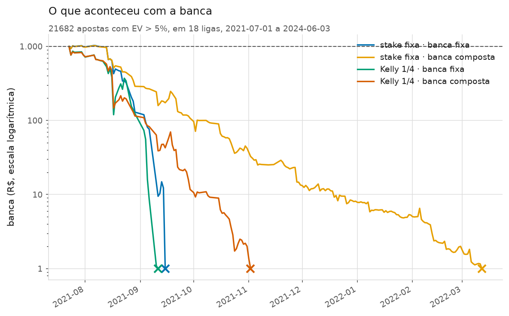
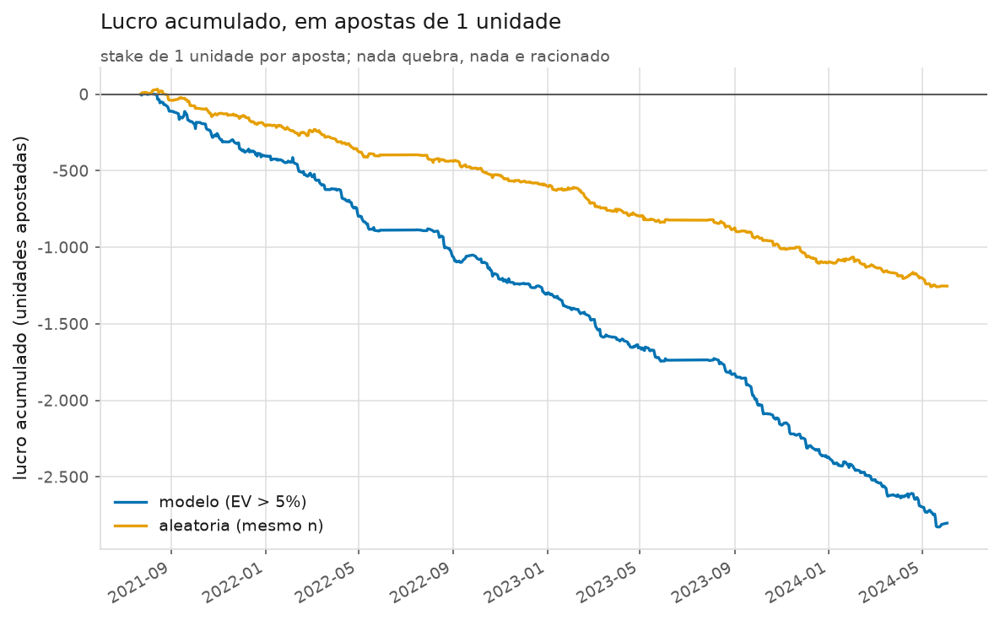

# Fase 6 — Backtest de apostas

- Modelo: **`dc-xi-0.003`** — Dixon-Coles com `xi = 0,003` e `m = 6`, o oficial do
  projeto desde a Fase 4 (regra 9). Nenhum parâmetro foi tocado nesta fase.
- Janela: **2021-07-01 a 2024-06-03** — a mesma da validação, com as
  temporadas de teste final trancadas (regra 7).
- Previsões: as do walk-forward, que nunca viram o próprio jogo (regra 6).
- Ligas que entraram (18): B1, D1, D2, E0, E1, E2, E3, F1, F2, G1, I1, I2, N1, P1, SC0, SP1, SP2, T1
- Jogos apostáveis: **20.189**
- Apostas candidatas: **100.945** (5 seleções por jogo)
- Limite de EV principal: **5%**
- Gerado em: 2026-09-17

> **Regra 13.** Todo número deste relatório é das **18 ligas aprovadas
> no filtro da Fase 2**, e só delas. As 16 competições do Grupo 2 estão fora por
> regra 12 (só têm odd de fechamento: nelas não existe nem aposta nem CLV), e as
> 4 ligas do Grupo 1 reprovadas no filtro também.

> **Regra 8.** Aposta-se sempre na **odd média pré-jogo** (`Avg*` na fonte).
> Nunca na `Max`. A odd de fechamento aparece **só** para medir CLV.

> **Regra 9.** Nada aqui escolhe modelo. O ROI é consequência reportada, nunca
> critério — e este relatório é um bom argumento de por que essa regra existe.

## A resposta, primeiro

**Não teria dado lucro, e não por pouco.**

Com **21.682 apostas** feitas ao longo de três temporadas nas
18 ligas aprovadas:

| | |
|---|---|
| **ROI** | **-12,92%** · IC 95% -14,97% a -10,89% · menor ROI detectável nesta amostra: 2,03% |
| **CLV** (critério primário) | **-7,82%** · IC 95% -7,95% a -7,69% · menor CLV detectável: 0,133% |
| Apostas | 21.682 — 5.000 é o mínimo que a seção 8.4 exige para o ROI ter poder |
| Taxa de acerto | 31,9% numa odd média de 3,80 |

⚠️ **A terceira conclusão possível — "a amostra é pequena demais para decidir" —
não é a deste relatório.** Ela seria a resposta honesta com algumas centenas de
apostas; aqui são vinte e uma mil, quatro vezes o mínimo da seção 8.4. O
intervalo de confiança do ROI fica inteiro abaixo de zero, e o do CLV também. A
conclusão é a segunda da tabela da seção 8.4: **não há evidência de vantagem** —
há evidência do contrário, medida com folga.

**E tem uma coisa pior, que é o achado de verdade desta fase.** Duas referências
para ler o -12,92% acima:

- apostar **ao acaso** entre as mesmas 100.945 oportunidades,
  nas mesmas ligas e no mesmo período, dá ROI de
  **-6,88%** — que é, essencialmente, a margem que a casa
  cobra;
- a estratégia aleatória de **mesmo tamanho** (21.682 apostas
  sorteadas) deu **-5,78%**.

Ou seja: **o filtro de valor esperado do modelo escolhe apostas piores do que as
sorteadas no chute.** Ele não deixa de encontrar vantagem — ele encontra
sistematicamente a desvantagem. A seção "Por que apertar o filtro piora tudo"
explica o mecanismo, e ele é interessante o bastante para valer a fase inteira.

## Como cada aposta foi decidida

Uma aposta acontece quando o **valor esperado** passa do limite:

```
EV = probabilidade do modelo × odd média pré-jogo − 1
```

e o limite principal é **5%** (`ev_minimo` no
`config.yaml`). Nada além disso entra na decisão: não há filtro de liga
"favorita", de odd mínima, de horário nem de sequência de resultados.

As seleções apostáveis são cinco, e **todas saem da mesma matriz de placares** do
modelo (decisão de 16/09/2026): vitória do mandante, empate, vitória do
visitante, mais de 2,5 gols e menos de 2,5 gols. "Ambos marcam" fica de fora
porque a fonte não traz odd desse mercado — sem preço não há aposta.

Cada aposta ficou registrada com data, jogo, mercado, odd, probabilidade do
modelo, EV, resultado, lucro e CLV, como a especificação pede. O arquivo sai com
`python scripts/backtest.py --gravar`.

**O que a simulação não cobra, e cobraria na vida real.** Ela aposta na média do
mercado depois de essa média existir, sem limite de aposta, sem conta limitada
pela casa, sem odd que sumiu antes do clique e sem comissão. Todas essas
fricções puxam o resultado real para **baixo** do simulado. Um backtest empatado
aqui seria perdedor na prática — e este nem empatado está.

Parâmetros de dinheiro usados (todos do `config.yaml`): banca inicial de
R$ 1.000,00, stake fixa de
1% da banca de referência, e
Kelly de 0,25 com teto de
5% por aposta.

## O que ficou de fora, e por quê

A Fase 1 avisou que **jogo sem odd não é um jogo sorteado ao acaso** — costuma
ser time pequeno, jogo adiado ou liga menor. Por isso os descartes são contados,
nunca silenciosos:

| Motivo | Jogos |
|---|---|
| Fora por **regra 12** (Grupo 2: só tem odd de fechamento) | 12.995 |
| Fora por **liga reprovada** no filtro da Fase 2 | 3.230 |
| Elegíveis (18 ligas aprovadas) | 20.221 |
| — pulados por **não ter odd média pré-jogo** | 32 |
| — sem a dupla de Over/Under pré-jogo | 0 |
| — sem odd de fechamento (ficariam sem CLV) | 0 |
| **Apostáveis** | **20.189** |

Dos 36.446 jogos que o walk-forward previu na janela, sobra
55,4% para o backtest. A perda é quase
toda de **regra**, não de buraco de dado: só
32 jogos das ligas aprovadas ficaram de
fora por falta de odd — 0,16%
deles. A cobertura de odds dessas 18 ligas é praticamente total, que é
justamente por que elas passaram no filtro da Fase 2.

## A tabela que responde a fase

Três apostadores, as mesmas ligas, a mesma janela, as mesmas odds:

- **modelo** — aposta quando o EV passa de 5%;
- **aleatória** — sorteia o mesmo número de apostas entre as candidatas, sem
  olhar probabilidade nenhuma (a comparação obrigatória da regra 2.6d);
- **todas as candidatas** — aposta em tudo. Não é uma estratégia: é a **régua**.
  Apostar em tudo tem retorno igual a menos a margem média da casa, e qualquer
  modelo que não fique acima dessa linha não está acrescentando informação.

| Quem aposta | Apostas | Acerto | Odd média | ROI | IC 95% do ROI | CLV | IC 95% do CLV |
|---|---|---|---|---|---|---|---|
| modelo | 21.682 | 31,9% | 3,80 | -12,92% | -14,97% a -10,89% | -7,82% | -7,95% a -7,69% |
| aleatória | 21.682 | 40,4% | 2,86 | -5,78% | -7,47% a -4,04% | -6,29% | -6,40% a -6,19% |
| todas as candidatas | 100.945 | 40,0% | 2,86 | -6,88% | -7,68% a -6,08% | -6,32% | -6,36% a -6,27% |

O modelo fica **abaixo** das duas referências, no ROI e no CLV. Os intervalos de
confiança do modelo e da régua não se tocam em nenhuma das duas colunas, então a
diferença não é ruído: filtrar por EV está ativamente escolhendo pior.

⚠️ A linha "aleatória" tem um ROI diferente da linha "todas as candidatas" porque
ela é **uma amostra** de 21.682 apostas, com o
ruído que isso traz; a régua usa as 100.945 candidatas e
é exata. As duas dizem a mesma coisa, e é de propósito que as duas aparecem: uma
mostra o valor, a outra mostra quanto ele balança.

## Apertar o filtro melhora? Não: piora, e de forma monótona

A varredura do limite de EV — as quatro configurações que a regra 11 manda
contar:

| Limite de EV | Apostas | Odd média | Acerto | ROI | IC 95% do ROI | CLV |
|---|---|---|---|---|---|---|
| 0% | 33.475 | 3,40 | 34,9% | -11,36% | -12,89% a -9,82% | -7,13% |
| 2% | 28.291 | 3,55 | 33,8% | -11,99% | -13,73% a -10,28% | -7,40% |
| 5% | 21.682 | 3,80 | 31,9% | -12,92% | -14,97% a -10,89% | -7,82% |
| 10% | 13.569 | 4,35 | 27,9% | -15,25% | -17,96% a -12,50% | -8,68% |

A leitura é a mais informativa do relatório. Se o modelo tivesse alguma vantagem,
**exigir mais EV deveria concentrar as apostas boas** e melhorar o ROI. Acontece
o contrário, e sem exceção: quanto mais o filtro aperta, pior fica o ROI, pior
fica o CLV e maior fica a odd média.

Isso descarta a hipótese consoladora de "o modelo tem sinal, só está diluído". Se
houvesse sinal diluído, ele apareceria concentrado em algum lugar da grade. Não
aparece em nenhum.

## Por que apertar o filtro piora tudo

A explicação não é sobre o modelo: é sobre **onde a casa cobra caro**. Olhando
todas as candidatas, sem filtro nenhum, agrupadas por faixa de odd:

| Faixa de odd | Candidatas | CLV médio da faixa | ROI da faixa | Apostas do modelo |
|---|---|---|---|---|
| 1,0 a 1,5 | 5.091 | -2,09% | -0,68% | 316 |
| 1,5 a 2,0 | 29.553 | -4,15% | -3,58% | 4.566 |
| 2,0 a 3,0 | 30.481 | -6,54% | -7,18% | 6.159 |
| 3,0 a 5,0 | 29.387 | -7,22% | -7,68% | 6.492 |
| 5,0 a 10,0 | 5.372 | -13,06% | -18,28% | 3.367 |
| acima de 10,0 | 1.061 | -21,41% | -39,75% | 782 |

A comissão da casa **não é uniforme**: ela é pequena no favorito e enorme no
azarão. Uma aposta de odd até 1,5 custa cerca de 2% de margem; uma acima de 10
custa mais de 20%. Isso não é novidade neste projeto — é exatamente o achado que
fez o método `power` vencer o proporcional na remoção de margem, lá na Fase 2, e
aqui ele reaparece cobrando a conta.

Agora junte com o funcionamento do filtro de EV. `EV = p × odd − 1` é
**multiplicativo na odd**: para um mesmo erro relativo do modelo na
probabilidade, quanto maior a odd, maior o EV que esse erro produz. Um erro de
dois pontos percentuais numa previsão de 10% vira EV alto num azarão; o mesmo
erro numa previsão de 60% quase não mexe no EV do favorito. O filtro, então, não
seleciona "onde o modelo sabe mais" — seleciona **onde o modelo erra para cima**,
e esse lugar é sistematicamente o azarão.

O resultado aparece na odd média: 2,86 entre todas as
candidatas, 3,80 entre as apostadas, e sobe a cada
aperto do limite de EV. O modelo está se mudando, por conta própria, para a parte
do mercado onde a casa cobra mais caro.

⚠️ **A lição que sobrevive a esta fase:** com um modelo que perde do mercado em
log loss, o filtro de EV não é um filtro de qualidade — é um **amplificador do
erro do modelo**. Ele só funcionaria se as probabilidades do modelo fossem, em
algum canto, melhores que as do mercado. A Fase 4 já tinha medido que elas não
são: 0,0226 de log loss atrás. A Fase 6 mostra o que esse número significa em
dinheiro.

## Por mercado

| Seleção | Apostas | Acerto | Odd média | ROI | IC 95% do ROI | CLV |
|---|---|---|---|---|---|---|
| vitória do mandante | 4.871 | 30,1% | 3,67 | -12,56% | -16,76% a -8,20% | -6,74% |
| empate | 3.039 | 20,1% | 4,86 | -12,55% | -19,00% a -5,84% | -10,20% |
| vitória do visitante | 6.433 | 20,6% | 5,46 | -18,84% | -23,04% a -14,18% | -10,24% |
| mais de 2,5 gols | 2.631 | 49,1% | 1,96 | -5,72% | -9,50% a -1,90% | -5,50% |
| menos de 2,5 gols | 4.708 | 47,1% | 2,01 | -9,49% | -12,29% a -6,69% | -5,38% |

Nenhuma seleção salva a estratégia, e o padrão acompanha a odd média: os dois
mercados de gols, com odd perto de 2,00, são os que perdem menos; a vitória do
visitante, com odd média acima de 5, é a que perde mais — o dobro do que perde o
"mais de 2,5 gols". É o mesmo viés azarão–favorito da seção anterior, visto por
outro corte. Repare também que o empate e a vitória do visitante são as duas
seleções com o pior CLV: são as de odd mais alta, e é nelas que a casa cobra
mais.

## Por liga — a tabela obrigatória

A especificação exige esta tabela (seção 4.3) por um motivo específico: **uma
média geral pode esconder que o lucro veio de uma liga só**, e com 18 ligas a
melhor delas parece boa por acaso com facilidade. Ligas com menos de
100 apostas ficariam de fora; nenhuma ficou.

| Liga | Apostas | Acerto | Odd média | ROI | IC 95% do ROI | CLV | IC 95% do CLV |
|---|---|---|---|---|---|---|---|
| E3 | 1.537 | 39,0% | 2,96 | -3,49% | -9,91% a +3,51% | -7,18% | -7,58% a -6,79% |
| D1 | 1.100 | 30,6% | 4,38 | -4,43% | -15,46% a +7,69% | -7,51% | -8,01% a -6,97% |
| E1 | 1.743 | 35,0% | 3,25 | -6,92% | -13,66% a -0,12% | -7,08% | -7,46% a -6,71% |
| F2 | 1.028 | 37,5% | 2,86 | -10,45% | -18,27% a -2,80% | -7,23% | -7,79% a -6,68% |
| SP2 | 1.327 | 37,7% | 2,90 | -11,41% | -18,23% a -4,13% | -5,85% | -6,34% a -5,37% |
| B1 | 914 | 32,6% | 3,75 | -11,88% | -20,87% a -2,41% | -7,66% | -8,39% a -6,87% |
| F1 | 1.382 | 29,1% | 4,08 | -11,92% | -19,94% a -3,93% | -7,73% | -8,24% a -7,23% |
| E0 | 1.526 | 28,0% | 4,76 | -13,26% | -21,88% a -4,16% | -7,28% | -7,76% a -6,78% |
| N1 | 1.135 | 26,8% | 5,22 | -13,49% | -23,37% a -3,17% | -11,31% | -12,03% a -10,60% |
| SP1 | 1.423 | 31,7% | 3,69 | -13,62% | -20,74% a -6,09% | -6,82% | -7,24% a -6,38% |
| I1 | 1.240 | 28,2% | 4,17 | -14,01% | -23,13% a -4,78% | -7,30% | -7,80% a -6,77% |
| I2 | 1.113 | 32,7% | 3,00 | -14,78% | -22,33% a -6,43% | -6,83% | -7,31% a -6,33% |
| E2 | 1.639 | 33,1% | 3,17 | -15,00% | -21,87% a -8,32% | -7,53% | -7,94% a -7,12% |
| D2 | 765 | 34,2% | 3,00 | -16,00% | -24,97% a -7,33% | -7,01% | -7,58% a -6,46% |
| G1 | 910 | 29,2% | 4,51 | -16,94% | -27,04% a -6,42% | -9,77% | -10,76% a -8,86% |
| SC0 | 686 | 26,7% | 5,09 | -19,00% | -32,58% a -5,68% | -10,77% | -11,77% a -9,76% |
| P1 | 1.146 | 27,1% | 4,97 | -21,54% | -30,76% a -12,05% | -10,49% | -11,23% a -9,74% |
| T1 | 1.068 | 29,5% | 3,50 | -24,34% | -31,97% a -16,81% | -8,20% | -8,89% a -7,49% |

- Ligas com **ROI positivo**: **0 de 18**.
- Ligas com **CLV positivo**: **0 de 18**. O critério
  de consistência da seção 8.4 pede a maioria; deu zero.
- Ligas cujo IC do ROI ainda cruza o zero (ou seja, onde a amostra sozinha não
  decidiria): **2**. Nas outras 16, o prejuízo é
  estatisticamente firme liga a liga.
- Tirando a melhor liga (`E3`, ROI -3,49%), o
  agregado vai para **-13,64%** — praticamente o mesmo. O
  resultado não depende de nenhuma liga: ele é uniforme.

A uniformidade é, por si, informação. Um prejuízo concentrado em duas ou três
ligas apontaria para um problema de dados ali; um prejuízo igual nas dezoito
aponta para o que de fato está acontecendo — o mercado é melhor que o modelo em
todas elas, e a margem é cobrada em todas elas.

### E por temporada

A outra metade do critério 2 da seção 8.4 — "consistente em mais de uma liga **e**
mais de uma temporada":

| Temporada | Apostas | ROI | CLV |
|---|---|---|---|
| 2021/22 | 7.346 | -12,10% | -7,41% |
| 2022/23 | 7.040 | -12,07% | -7,70% |
| 2023/24 | 7.296 | -14,59% | -8,35% |

Negativo em **3 das 3** temporadas, com ROI parecido nas
três. Não houve um ano ruim puxando a média: houve três anos iguais.

## As quatro variantes de dinheiro

A especificação exige que as **duas** variantes de banca apareçam, porque omitir
qual foi usada é uma das formas mais comuns de relatório enganoso:

- **banca fixa** — a stake sai sempre da banca **inicial**. 1% de 1.000 é dez
  reais na primeira aposta e dez reais na milésima;
- **banca composta** — a stake sai da banca **atual**. Compõe como juros, para
  cima e para baixo. Numa série perdedora ela **suaviza** o estrago, porque
  aposta cada vez menos; num relatório vencedor, ela infla o número. Mostrar só
  uma delas é sempre suspeito.

Partindo de R$ 1.000,00, com as 21.682 apostas
de EV > 5%:

| Estratégia | Banca | Banca final (R$) | ROI sobre o apostado | Drawdown máximo | Apostas feitas | Sobreviveu até | Dias racionados |
|---|---|---|---|---|---|---|---|
| stake fixa | banca fixa | 0,00 | -17,59% | 100,0% | 977 | 2021-09-15 | 11 |
| stake fixa | banca composta | 0,00 | -14,16% | 100,0% | 21.682 | 2024-06-02 | 32 |
| Kelly 1/4 | banca fixa | 0,00 | -14,82% | 100,0% | 977 | 2021-09-15 | 20 |
| Kelly 1/4 | banca composta | 0,00 | -17,28% | 100,0% | 21.682 | 2024-06-02 | 174 |

**As quatro terminam em zero.** E aqui vale separar duas coisas que a tabela
mistura, porque confundi-las levaria a uma conclusão errada:

1. **A parte que é sobre o modelo** é o ROI por unidade apostada
   (-12,92%). Esse número mede a qualidade das
   escolhas e não depende de política de dinheiro nenhuma;
2. **A parte que é sobre a política de aposta** é a ruína. O modelo aponta
   28,1 apostas por dia, em média. Apostar 1% da banca em
   cada uma delas significa pôr cerca de 28% da
   banca em risco **por dia** — o que é inviável mesmo com um modelo vencedor.
   Com a banca fixa, o dinheiro acaba em poucas semanas.

A coluna "dias racionados" conta os dias em que a soma das stakes pedidas passou
da banca disponível e teve de ser reduzida proporcionalmente. A simulação nunca
aposta dinheiro que não existe — e conta quantas vezes precisou segurar a mão,
porque uma trava que age em silêncio muda o resultado sem aparecer.

⚠️ **Uma armadilha de leitura que esta tabela desarma:** com a banca composta, a
curva passa a apostar centavos depois de perder quase tudo, e o "ROI sobre o
apostado" dela fica **menos negativo** que o da banca fixa. Isso não é um sinal
de que compor funciona melhor: é aritmética de quem aposta menos depois de
perder. Os dois números descrevem a mesma série de apostas ruins.



O eixo é logarítmico de propósito: numa escala linear, uma banca em R$ 10 e outra
em R$ 0,10 são a mesma linha colada no chão, e a diferença entre elas é de cem
vezes. O `x` marca onde a banca acabou.



Este segundo gráfico tira o dinheiro do caminho: stake de 1 unidade, sempre,
nada quebra. É a qualidade das escolhas ao longo dos três anos — e o que ele
mostra é uma **ladeira constante**, não um tombo. Prejuízo em linha reta durante
três temporadas não é azar; é a ausência de vantagem aparecendo devagar.

## Relatório de poder estatístico (obrigatório, regra 10)

Um ROI sem esta seção não quer dizer nada — nem para cima, nem para baixo. As
duas perguntas que acompanham todo número deste relatório:

| Pergunta | ROI | CLV |
|---|---|---|
| Quantas apostas houve | 21.682 | 21.682 |
| Desvio-padrão medido (por aposta) | 1,528 | 0,100 |
| Erro-padrão da média | 1,04% | 0,068% |
| **Com esta amostra, o menor efeito detectável a 95% é** | **2,03%** | **0,133%** |
| Apostas necessárias para enxergar o efeito medido | 536 | 6 |

Como ler essa tabela:

- **o ROI.** A amostra enxerga qualquer ROI verdadeiro maior que
  2,03%, para cima ou para baixo. O medido foi
  -12,92% — seis vezes o limiar. Não é uma amostra insuficiente
  mostrando ruído; é uma desvantagem grande, medida com sobra;
- **o CLV.** Aqui a diferença de escala salta aos olhos e é o ponto inteiro da
  seção 8.3: o desvio-padrão do CLV é **15
  vezes menor** que o do ROI, porque o CLV de cada aposta não depende do
  resultado do jogo — só de dois preços. Com isso, bastariam
  6 apostas para enxergar o efeito medido, contra
  536 no ROI. É por isso que o CLV é o critério
  primário;
- **o custo de medir uma vantagem pequena.** Um ROI verdadeiro de +2% — que já
  seria excelente e realista — exigiria cerca de
  **22.412 apostas** para ser distinguido de
  zero com a volatilidade medida aqui. Este backtest tem
  21.682. Ou seja: mesmo com todo o escopo de 18 ligas e três
  temporadas, o projeto **ainda não teria poder** para confirmar um edge pequeno
  pelo ROI. Teria pelo CLV — e é exatamente por isso que a seção 8.3 promoveu o
  CLV a critério primário.

## CLV — o critério primário, e as duas formas de escrevê-lo

CLV (*closing line value*) é a comparação entre **o preço que você pegou** e o
preço com que o mercado fechou. Ele é o critério primário do projeto (seção 8.3)
por uma razão estatística: não depende do resultado do jogo, então converge com
centenas de apostas em vez de dezenas de milhares.

Há duas formas de escrever esse número, e este relatório traz as duas porque elas
medem coisas diferentes:

| | O que é | Modelo | Aleatória | Todas as candidatas |
|---|---|---|---|---|
| **CLV** (principal) | `odd pega × probabilidade justa do fechamento − 1`. Compara o preço pego com a **estimativa** final do mercado, já sem a comissão da casa. | **-7,82%** | -6,29% | -6,32% |
| **CLV bruto** | `odd pega ÷ odd de fechamento − 1`. Compara dois preços de balcão, com a comissão dentro dos dois lados. | -0,204% | -0,148% | -0,179% |

**Os dois números contam uma história em duas partes, e é importante não trocar
uma pela outra:**

1. **O CLV bruto é quase zero** (-0,204%). Isso quer dizer
   que as apostas do modelo **não antecipam o movimento da linha**: em média, o
   preço pego é praticamente o mesmo com que o mercado fechou. O modelo não sabe
   nada que o mercado vá descobrir depois. Não é escandaloso — é nulo;
2. **O CLV principal é bem negativo** (-7,82%), e é ele que decide.
   A diferença entre os dois é a **comissão da casa**: o preço de balcão pode não
   ter se mexido, mas ele nunca foi justo para começar. Apostar na média do
   mercado e ver o mercado fechar no mesmo lugar significa pagar a margem inteira.

E a comparação final, que é a que fecha a fase: apostar **ao acaso** dá CLV de
-6,32% — a margem média. O modelo dá -7,82%.
Ele piora o próprio preço em cerca de
1,5% ao escolher, porque escolhe azarão
(ver "Por que apertar o filtro piora tudo").

⚠️ **Critério 1 da seção 8.4 — "CLV médio positivo com IC inteiro acima de
zero": reprovado.** O IC fica inteiro **abaixo** de zero
(-7,95% a -7,69%), com 21.682 apostas e um limiar de
detecção de 0,133%. Não é dúvida; é um não medido
com precisão de três casas.

⚠️ **Lembrete de escopo (regra 12):** este CLV vem inteiramente das 18 ligas
aprovadas do Grupo 1. Nenhuma liga do Grupo 2 — Brasileirão incluído — pode
entrar aqui, porque nelas só existe odd de fechamento, e comparar o fechamento
consigo mesmo daria zero por construção.

## Pré-registro e multiplicidade (regra 11)

| | |
|---|---|
| Configurações de **modelo** testadas até aqui | **29** — 13 exploratórias (Fase 3) + 13 oficiais (Fase 4) + 3 (Fase 5) |
| Configurações de **aposta** testadas nesta fase | **16** — 4 limites de EV × 2 estratégias de stake × 2 tipos de banca |
| **Total acumulado** | **45** |
| Configuração de modelo escolhida | `{'modelo': 'dixon-coles', 'xi': 0.003, 'm': 6.0}` — **inalterada pela Fase 6** |
| Critério de escolha de modelo | log loss no walk-forward (regra 9). **Nunca** o ROI desta fase |
| Nível com correção de Bonferroni | 0,05 / 16 = 0,0031 |
| Data | 2026-09-17 |

**Sobre a correção de Bonferroni.** Ela existe para o caso em que alguma
configuração aparece lucrativa: comparando 16 combinações, a chance de pelo menos
uma parecer boa por acaso é bem maior que 5%, e o nível teria de ser apertado
para 0,0031. Neste relatório
a correção não muda nada, porque **nenhuma das 16 deu resultado positivo** — não
há um vencedor para desconfiar. Vale registrar o número mesmo assim: a regra 11
existe para ser cumprida antes de saber o resultado, não depois.

⚠️ O total **soma** e nunca é reescrito para baixo. Ele existe para que a Fase 9,
ao abrir o teste final uma única vez, saiba quantas chances o projeto deu a si
mesmo de encontrar um vencedor por acaso.

## Conclusão

**Não há evidência de vantagem. Há evidência de desvantagem, e ela é firme.**

Percorrendo os critérios da seção 8.4, um a um:

| Critério | Resultado |
|---|---|
| 1. CLV médio positivo com IC acima de zero | ❌ **-7,82%**, IC -7,95% a -7,69% — inteiro abaixo de zero |
| 2. Consistência entre ligas e temporadas | ❌ negativo nas **18 de 18** ligas e nas **3 de 3** temporadas |
| 3. Configuração pré-registrada | ✅ desde 17/09/2026, inalterada |
| 4. ROI positivo com IC acima de zero | ❌ **-12,92%**, IC -14,97% a -10,89% |
| 5. Pelo menos 5.000 apostas | ✅ 21.682 |

Como os critérios 1, 2 e 4 falham com a amostra já grande o suficiente (critério
5 cumprido), a conclusão da seção 8.4 se aplica sem atenuante: **o modelo não tem
vantagem demonstrável sobre as casas de aposta.**

**Isso era o resultado esperado, e o projeto disse isso antes de medir.** A
Fase 4 já tinha estabelecido que o modelo oficial fica **0,0226 de log loss atrás
do mercado**. Um modelo atrás do mercado, apostando contra o mercado e ainda
pagando a comissão da casa, tem um resultado aritmeticamente previsível. A Fase 6
não descobriu que o modelo é ruim; ela **traduziu em dinheiro** um número que já
estava medido — e essa tradução é o produto da fase.

**O que a fase entrega de valor, além do "não":**

1. **O mecanismo do prejuízo, identificado.** O filtro de EV não é neutro: como
   `EV = p × odd − 1` é multiplicativo na odd, ele seleciona sistematicamente
   azarões — que é exatamente onde a casa cobra a maior comissão (de 2% em odd
   1,5 a mais de 20% acima de odd 10). Um modelo sem vantagem, filtrado por EV,
   perde **mais** do que apostando ao acaso: -12,92% contra
   -6,88%;
2. **A confirmação empírica da seção 8.3.** O desvio-padrão do CLV medido nos
   próprios dados é 15 vezes menor que o do
   ROI. O CLV realmente é o único sinal de vantagem mensurável na escala deste
   projeto;
3. **A régua para as próximas fases.** Qualquer ideia futura — múltiplas
   (Fase 7), desfalques e notícias (Fase 10) — passa a ter um alvo numérico
   claro: para virar o jogo, ela precisa valer mais de
   7,8% de CLV. Isso é muito, e saber que é muito vale
   mais do que tentar sem saber.

⚠️ **O que NÃO se deve concluir daqui.** Que "modelo de futebol não funciona" —
isto mediu **um** modelo, com **estas** features, contra a odd média pré-jogo de
**estas** 18 ligas. E, principalmente: nada disso vira licença para apostar
dinheiro real "corrigindo um detalhe". O caminho honesto é o inverso — o projeto
segue medindo, e a Fase 9 abrirá o teste final uma única vez, com a configuração
que já está pré-registrada.

---

*Apostas envolvem risco real de perda. Este projeto é educacional. Quem sentir
que perdeu o controle pode procurar apoio: Jogadores Anônimos, ou o CVV pelo
telefone 188.*