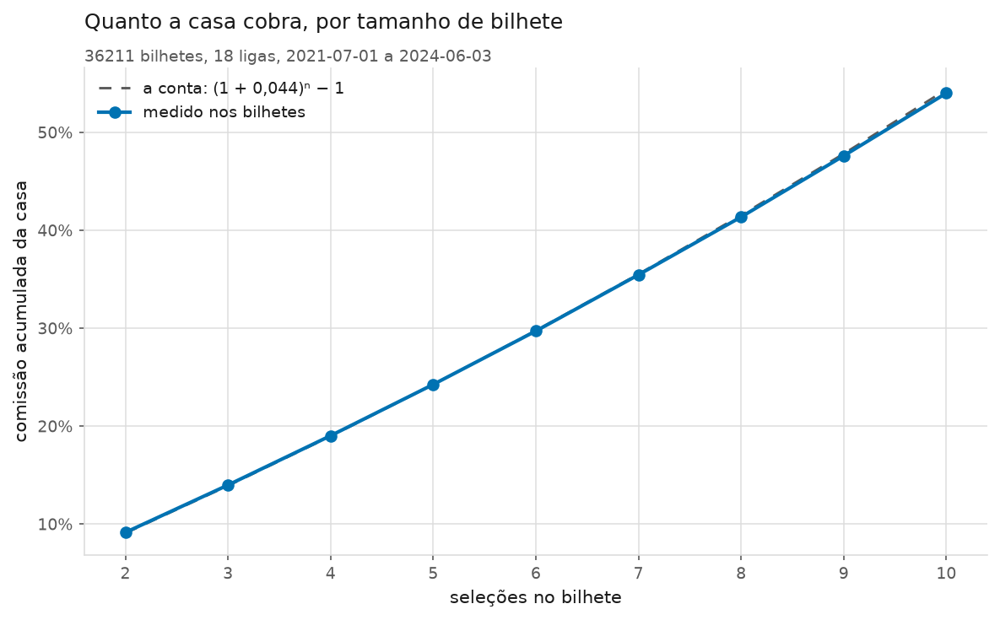
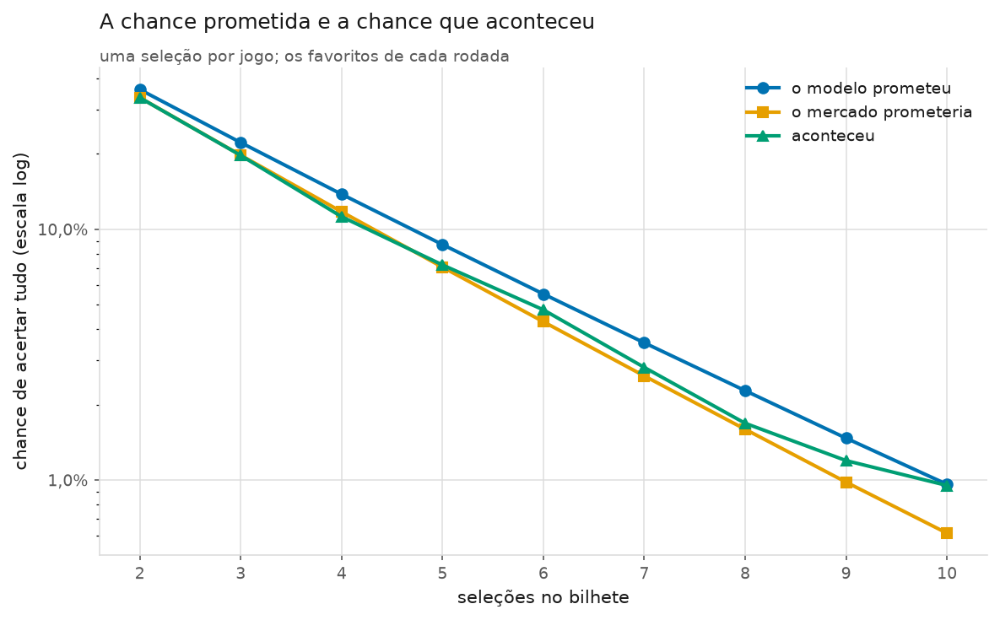

# Fase 7 — Múltiplas e cash out

- Modelo: o oficial do projeto (Dixon-Coles, `xi = 0,003`, `m = 6`). Nada foi
  alterado nele nesta fase.
- Janela: **2021-07-01 a 2024-06-03** — a mesma da validação, com as
  temporadas de teste final trancadas (regra 7).
- Ligas: as **18 aprovadas** no filtro da Fase 2 (regra 12 e regra 13).
- Bilhetes montados: **36.211**, em
  724 rodadas, de
  2 a 10 seleções.
- Seleções usadas: **164.562**.
- Faixa de odd por seleção: 1,20 a
  5,00 (`config.yaml`).
- Gerado em: 2026-09-17

> **A restrição que não é negociável:** no máximo **uma seleção por jogo**. Os
> mercados de uma mesma partida são fortemente correlacionados — se o mandante
> goleia, "mais de 2,5 gols" fica muito mais provável — e multiplicar essas duas
> chances daria um número errado para mais, sem que nenhum teste percebesse.

> **Regra 9.** Nada aqui escolhe modelo. Múltipla é consequência medida, nunca
> critério.

## As três respostas, primeiro

**1. A comissão da casa se multiplica, e isso é aritmética.** Numa aposta
simples ela é de 4,44%;
num bilhete de 10 jogos vira
**54,0%**. Não é a casa sendo mais gananciosa com
múltiplas: é a mesma taxa, cobrada 10 vezes seguidas, uma em
cima da outra. O bilhete de 10 jogos custa
1,54 vezes o que ele vale.

**2. A chance de ganhar mostrada é otimista demais — mas a culpa é do modelo,
não da independência entre os jogos.** Esta é a descoberta da fase, e ela
contraria o que a especificação esperava encontrar. O modelo promete
36,1% num bilhete de
2 jogos e acontece 33,5%; num de
8, promete 2,27% e
acontece 1,68%. Mas quando a **mesma conta** é feita com as
probabilidades do mercado, ela acerta em cheio em todos os tamanhos. Ou seja: o
produto simples não é o problema — o que entra nele é.

**3. O cash out não muda o resultado, e o motivo é uma identidade, não um
acaso.** O valor esperado de sacar é o valor esperado de não sacar multiplicado
por `(1 − taxa)`. **Não importa quando você aperta o botão** — depois de um
acerto ou depois de nove, a conta dá exatamente o mesmo. O que muda é só a
variância.

A razão entre o que o mercado diz e o que o modelo diz, **por seleção**, fica em
torno de 0,959 em todos os
9 tamanhos medidos. É esse número que explica tudo: o modelo
exagera a chance de cada perna em cerca de
4,1%, e num bilhete de
8 jogos esse exagerozinho vira
28,5%.

## Como os bilhetes foram montados

Em cada data em que houve jogo, o procedimento foi sempre o mesmo:

1. pegar **uma seleção por partida** — aquela em que o modelo tem mais confiança;
2. descartar as de odd fora da faixa 1,20–5,00;
3. ordenar da mais provável para a menos provável;
4. cortar em blocos do tamanho pedido. O primeiro bilhete leva os maiores
   favoritos do dia, o segundo os seguintes, e assim por diante. A sobra é
   descartada.

⚠️ **Por que blocos, e não um bilhete por rodada.** Duas razões, as duas sobre
honestidade estatística. A primeira é amostra: um bilhete por data daria
setecentos bilhetes por tamanho, e com uma chance de acerto de 1% isso não mede
nada — os blocos dão 36.211. A segunda é
que os blocos **não compartilham partidas** dentro de uma mesma rodada. Se dois
bilhetes do mesmo sábado tivessem jogos em comum, o acerto de um estaria amarrado
ao do outro, e o intervalo de confiança sairia mais estreito do que a realidade.

⚠️ **A seleção é escolhida por probabilidade, não por valor esperado** — e é uma
decisão com preço declarado. A Fase 6 mediu o que o filtro de EV faz: ele empurra
a carteira para os azarões, que é onde a casa cobra mais, e o ROI piora. Numa
múltipla isso seria pior ainda, porque cada azarão multiplica a chance de o
bilhete inteiro morrer. O preço da decisão é que estes bilhetes são de favoritos,
e o que se mede aqui vale para eles.

## 1. A comissão se multiplica

| Seleções | Bilhetes | Odd total média | Comissão acumulada | Equivale a, por seleção |
|---|---|---|---|---|
| 2 | 9.882 | 2,87 | 9,1% | 4,47% |
| 3 | 6.465 | 4,88 | 14,0% | 4,46% |
| 4 | 4.754 | 8,33 | 19,0% | 4,45% |
| 5 | 3.716 | 14,22 | 24,3% | 4,44% |
| 6 | 3.036 | 24,31 | 29,7% | 4,43% |
| 7 | 2.558 | 41,88 | 35,5% | 4,43% |
| 8 | 2.196 | 71,77 | 41,4% | 4,42% |
| 9 | 1.923 | 123,72 | 47,6% | 4,42% |
| 10 | 1.681 | 212,55 | 54,0% | 4,41% |

A última coluna é a prova de que não há mistério: a comissão por seleção fica
praticamente **constante** em
4,41%–4,47%
nos nove tamanhos. O que cresce é o efeito de cobrá-la várias vezes:

```
comissão do bilhete = (1 + 0,0444)ⁿ − 1
```



Com 4,44% por seleção, um bilhete de
10 jogos carrega
**54,0%** de comissão. Em dinheiro: um bilhete que
deveria pagar R$ 100 paga cerca de
R$ 65.

⚠️ **Esta é a única parte da fase que não depende de modelo nenhum.** Ela vale
para você, para mim e para um apostador perfeito: juntar jogos num bilhete só
multiplica a comissão, sempre. É por isso que a múltipla é o produto mais
lucrativo de uma casa de apostas.

## 2. A chance prometida contra a chance que aconteceu

| Seleções | Bilhetes | O modelo prometeu | O mercado prometeria | Aconteceu | Acertos | Erro do modelo | Razão por seleção |
|---|---|---|---|---|---|---|---|
| 2 | 9.882 | 36,12% | 33,53% | 33,51% | 3.311 | -7,2% | 0,963 |
| 3 | 6.465 | 22,20% | 19,76% | 19,72% | 1.275 | -11,1% | 0,962 |
| 4 | 4.754 | 13,81% | 11,75% | 11,23% | 534 | -18,7% | 0,960 |
| 5 | 3.716 | 8,70% | 7,07% | 7,21% | 268 | -17,1% | 0,959 |
| 6 | 3.036 | 5,52% | 4,28% | 4,78% | 145 | -13,5% | 0,958 |
| 7 | 2.558 | 3,53% | 2,60% | 2,81% | 72 | -20,2% | 0,957 |
| 8 | 2.196 | 2,27% | 1,59% | 1,68% | 37 | -25,9% | 0,957 |
| 9 | 1.923 | 1,47% | 0,98% | 1,20% | 23 | -18,6% | 0,956 |
| 10 | 1.681 | 0,96% | 0,61% | 0,95% | 16 | -1,1% | 0,956 |



**O modelo erra para cima em todos os nove tamanhos**, e o erro relativo tende a
crescer com o bilhete: -7,2%
numa dupla contra
-25,9%
num bilhete de 8.

⚠️ A coluna balança bastante de uma linha para a outra, e a última delas
(-1,1% em dez seleções)
parece dizer que o modelo acertou em cheio. Não diz: são
16 acertos em
1.681 bilhetes, e com essa
contagem qualquer número caberia ali. **A tendência vale; cada linha isolada,
não.**

A última coluna explica o porquê, e é a coluna mais importante do relatório. Ela
é a razão entre o que o mercado diz e o que o modelo diz, **por seleção** — ou
seja, o exagero do modelo numa perna só, isolado do tamanho do bilhete. Ela fica
em 0,956–0,963
nos nove tamanhos, praticamente constante.

**O que isso quer dizer, em português:** o modelo exagera a chance de cada
seleção em cerca de 4,1%. Só isso. Num bilhete de dois
jogos, esse exagero aparece como 8,1%; num de oito,
como 28,5%. **Não é um erro novo que aparece nas
múltiplas — é o mesmo errinho de sempre, elevado à potência do número de
jogos.**

É exatamente o que a Fase 4 já tinha medido de outro jeito: o modelo fica 0,0226
de log loss atrás do mercado. Aqui dá para ver esse número virando dinheiro, e
virando dinheiro **mais rápido** a cada jogo acrescentado ao bilhete.

## 3. A independência entre jogos — o que a fase foi procurar

⚠️ **Leia esta seção antes de acreditar em qualquer chance de ganhar mostrada
por um app de apostas, inclusive o deste projeto.**

A chance de uma múltipla acertar é calculada como o **produto** das chances de
cada seleção. Isso supõe que os jogos são independentes: que saber o resultado de
um não muda nada sobre o outro. Dentro de uma mesma partida a suposição é
claramente falsa, e por isso o projeto proíbe duas seleções do mesmo jogo. Entre
partidas diferentes, sobra uma correlação menor e real — rodadas com muitos gols,
efeitos de calendário, e principalmente o **erro compartilhado do próprio
modelo**. Essa correlação, se existir, empurra a chance real para **baixo** da
calculada, e cada vez mais conforme o bilhete cresce.

A fase foi medir isso. O truque é usar as probabilidades **justas do mercado** no
mesmo produto: a Fase 2 mediu que o mercado é bem calibrado jogo a jogo, então se
o produto dele também errar para cima, o culpado é a suposição de independência,
e não o modelo.

| Seleções | O mercado prometeria | Aconteceu | Erro do mercado | IC 95% do erro | Menor erro detectável |
|---|---|---|---|---|---|
| 2 | 33,53% | 33,51% | -0,1% | -2,7% a +2,7% | 2,7% |
| 3 | 19,76% | 19,72% | -0,2% | -5,0% a +4,7% | 4,8% |
| 4 | 11,75% | 11,23% | -4,4% | -11,8% a +3,1% | 7,5% |
| 5 | 7,07% | 7,21% | +2,0% | -9,5% a +13,9% | 11,6% |
| 6 | 4,28% | 4,78% | +11,5% | -5,6% a +29,5% | 17,5% |
| 7 | 2,60% | 2,81% | +8,2% | -15,2% a +33,6% | 24,4% |
| 8 | 1,59% | 1,68% | +5,7% | -26,8% a +39,1% | 33,3% |
| 9 | 0,98% | 1,20% | +21,9% | -24,7% a +73,1% | 49,0% |
| 10 | 0,61% | 0,95% | +55,0% | -13,3% a +134,0% | 75,1% |

**O resultado: não há erro detectável.** O intervalo de confiança contém o zero
em **todos os nove tamanhos**, e nos bilhetes pequenos — onde a amostra tem
força — o erro medido é praticamente nulo
(-0,13% na média de
duplas e triplas, com um limiar de detecção de
3,8%).

Ou seja: **o produto simples das probabilidades não superestimou nada**, desde
que as probabilidades que entram nele estejam certas. A correlação entre jogos
de rodadas reais, se existe, é pequena demais para aparecer em trinta e seis mil
bilhetes.

⚠️ **O limite honesto desta conclusão, que é grande e precisa ser dito.** Repare
na última coluna: o menor erro detectável cresce de
2,7% num bilhete
de dois jogos para
75% num de
dez. A conclusão "não há correlação" é **forte** nos bilhetes de 2 a 4 seleções e
**fraca** de 6 em diante, onde a amostra não enxergaria nem um efeito grande. O
certo é dizer: *em bilhetes pequenos, medimos que não há; em bilhetes grandes,
não conseguimos medir.*

**E o item opcional da especificação?** A seção 7.1 prevê, "só se sobrar tempo",
modelar a correlação com um efeito compartilhado por rodada. Ele **não foi
implementado**, e agora por um motivo melhor do que falta de tempo: ele existiria
para reduzir um descasamento que não foi encontrado. Implementá-lo seria
acrescentar um parâmetro ao projeto para corrigir um problema que a medição não
achou — exatamente o tipo de complexidade que a Fase 5 decidiu não carregar.

## 4. O ROI por tamanho de bilhete

| Seleções | Bilhetes | Odd total média | Acertos | ROI | IC 95% do ROI |
|---|---|---|---|---|---|
| 2 | 9.882 | 2,87 | 3.311 | -8,73% | -11,30% a -6,09% |
| 3 | 6.465 | 4,88 | 1.275 | -12,23% | -16,76% a -7,62% |
| 4 | 4.754 | 8,33 | 534 | -22,03% | -28,51% a -15,14% |
| 5 | 3.716 | 14,22 | 268 | -18,84% | -29,06% a -8,37% |
| 6 | 3.036 | 24,31 | 145 | -13,06% | -28,45% a +3,15% |
| 7 | 2.558 | 41,88 | 72 | -17,53% | -38,26% a +5,93% |
| 8 | 2.196 | 71,77 | 37 | -43,67% | -64,16% a -20,78% |
| 9 | 1.923 | 123,72 | 23 | -34,13% | -65,54% a +3,20% |
| 10 | 1.681 | 212,55 | 16 | +7,95% | -54,27% a +86,84% |

⚠️ **Repare no intervalo de confiança, e não no ROI.** Da sexta seleção em
diante ele passa de trinta pontos percentuais de largura, e no bilhete de dez
jogos vai de -54% a +87%.
Isso não é uma medição: é uma loteria com
16 prêmios sorteados em
1.681 bilhetes.

É o mesmo fenômeno da Fase 6, agora numa versão extrema. Um bilhete de dez jogos
paga odd média 213 e
acerta menos de 1% das vezes — o resultado de mil bilhetes desses é decidido por
meia dúzia de sortes. **Múltipla grande é o lugar onde o ROI menos significa
alguma coisa**, e é justamente onde ele é mais citado por quem vende palpite.

O número em que se pode confiar é o da seção 1: a comissão acumulada. Ela não
depende de sorte nenhuma, e em dez jogos ela é de
54,0%.

## 5. O cash out

O cash out é o botão que a casa oferece com o bilhete em andamento: "você
acertou 4 de 6, aceita R$ 30 agora?". A oferta é o **valor justo do que falta**
menos uma taxa — aqui simulada em 8%
(`cash_out_margem_casa` no `config.yaml`).

**Bilhetes de 2 seleções**

| Estratégia | Valor esperado | ROI que aconteceu | IC 95% do ROI | Sacou em |
|---|---|---|---|---|
| nunca sacar | -8,34% | -8,73% | -11,30% a -6,09% | 0,0% |
| sacar após 1 acerto(s) | -15,68% | -15,51% | -16,98% a -14,08% | 58,2% |
| sacar só quando a oferta compensa | -9,24% | -9,83% | -12,34% a -7,26% | 6,7% |

**Bilhetes de 6 seleções**

| Estratégia | Valor esperado | ROI que aconteceu | IC 95% do ROI | Sacou em |
|---|---|---|---|---|
| nunca sacar | -22,76% | -13,06% | -28,45% a +3,15% | 0,0% |
| sacar após 1 acerto(s) | -28,94% | -28,34% | -30,42% a -26,19% | 60,0% |
| sacar após 2 acerto(s) | -28,94% | -31,01% | -34,46% a -27,51% | 34,4% |
| sacar após 3 acerto(s) | -28,94% | -31,40% | -36,32% a -26,15% | 20,3% |
| sacar após 4 acerto(s) | -28,94% | -31,12% | -38,11% a -23,93% | 12,0% |
| sacar após 5 acerto(s) | -28,94% | -22,14% | -32,48% a -11,35% | 7,7% |
| sacar só quando a oferta compensa | -24,54% | -15,90% | -29,90% a -1,33% | 11,1% |

**Bilhetes de 10 seleções**

| Estratégia | Valor esperado | ROI que aconteceu | IC 95% do ROI | Sacou em |
|---|---|---|---|---|
| nunca sacar | -34,79% | +7,95% | -54,27% a +86,84% | 0,0% |
| sacar após 1 acerto(s) | -40,01% | -42,71% | -45,07% a -40,33% | 57,9% |
| sacar após 2 acerto(s) | -40,01% | -41,79% | -45,54% a -37,97% | 35,5% |
| sacar após 3 acerto(s) | -40,01% | -44,87% | -50,26% a -39,27% | 20,8% |
| sacar após 4 acerto(s) | -40,01% | -44,81% | -52,22% a -37,22% | 12,7% |
| sacar após 5 acerto(s) | -40,01% | -46,91% | -56,41% a -36,68% | 7,6% |
| sacar após 6 acerto(s) | -40,01% | -54,54% | -66,13% a -41,93% | 4,1% |
| sacar após 7 acerto(s) | -40,01% | -47,68% | -64,93% a -28,47% | 2,7% |
| sacar após 8 acerto(s) | -40,01% | -52,41% | -71,73% a -29,36% | 1,8% |
| sacar após 9 acerto(s) | -40,01% | -31,03% | -63,44% a +7,66% | 1,4% |
| sacar só quando a oferta compensa | -36,61% | -33,81% | -70,26% a +12,63% | 7,9% |

⚠️ **Duas colunas de ROI, e a que importa é a primeira.** O "ROI que aconteceu"
depende de quais bilhetes acertaram e, num bilhete de dez jogos que acerta 1% das
vezes, é quase puro ruído — repare nos intervalos. O "valor esperado" é a conta
feita com os preços, não depende de resultado nenhum, e é ele que separa as
estratégias de verdade.

Sem essa distinção a tabela levaria à conclusão **oposta** da correta: em
bilhetes de 6 seleções, "sacar após 1 acerto" mostra ROI de
-28,34% contra -13,06% de "nunca sacar", e
parece melhor. Não é. Ele só tem menos variância — e o valor esperado dele é
-28,94% contra -22,76%.
**Sacar é pior, e é pior exatamente pela taxa.**

**O achado mais limpo da seção:** o valor esperado de "sacar após N acertos" é
**idêntico para todo N**. Sacar depois de um acerto ou depois de nove dá a mesma
conta. Isso não é coincidência dos dados — é uma identidade:

```
valor esperado de sacar = valor esperado de não sacar × (1 − taxa)
```

A chance de chegar vivo ao ponto de saque, multiplicada pela chance do que
ainda falta, é sempre a chance do bilhete inteiro. O que sobra é o desconto. **O
botão cobra a mesma coisa não importa quando você o aperta** — a única coisa que
muda é o tamanho do susto.

E a terceira regra, a que usa informação? "Sacar só quando a oferta compensa"
(isto é, quando a oferta passa do valor justo **segundo o modelo**) fica **entre
as duas**, e ainda assim perde para "nunca sacar". A explicação é a mesma de
sempre: para ganhar dinheiro identificando ofertas generosas, seria preciso ter
probabilidades melhores que as do mercado. O projeto mediu na Fase 4 que não tem.

### A distribuição dos acertos, por Monte Carlo

Num bilhete de 10 seleções, com que frequência ele termina com
cada número de acertos:

| Acertos | Frequência |
|---|---|
| 2 | 1,2% |
| 3 | 4,5% |
| 4 | 11,7% |
| 5 | 20,5% |
| 6 | 24,9% |
| 7 | 21,1% |
| 8 | 11,6% |
| 9 | 3,7% |
| 10 | 0,6% |

O caso mais comum é **6 de 10** — que paga zero. Essa
tabela é a experiência de quem joga múltipla grande descrita em números: quase
sempre você vai assistir à maior parte dos jogos dar certo e não receber nada.

⚠️ **Este é o único uso do Monte Carlo nesta fase, e é de propósito.** A
especificação avisa (seção 7.1) que sortear jogos de forma independente **não**
corrige a correlação entre partidas — só reproduz o produto das probabilidades
com ruído a mais. Mas para a pergunta "como se distribuem os acertos parciais" o
sorteio é o caminho curto para uma conta que existe e é chata de fazer à mão.

## 6. O montador de bilhetes

O montador é a peça que vira tela na Fase 8. Ele responde a duas perguntas: "monte
um bilhete de N jogos" e "monte um bilhete que pague R$ X". Em ambos os casos o
critério é a **maior chance de ganhar**, nunca o maior valor esperado — a Fase 6
mostrou aonde escolher por valor esperado leva.

A tabela comparativa é o argumento da fase inteira numa figura só. Cada jogo a
mais multiplica o prêmio, multiplica a comissão e divide a chance:

| Seleções | Odd total | Prêmio de R$ 10 | Chance (modelo) | Ou seja | Comissão acumulada |
|---|---|---|---|---|---|
| 1 | 1,45 | 14,50 | 76,1% | 1 em 1,3 | 1,9% |
| 2 | 1,80 | 17,98 | 56,3% | 1 em 1,8 | 4,1% |
| 3 | 2,55 | 25,53 | 41,6% | 1 em 2,4 | 6,1% |
| 4 | 3,50 | 34,98 | 30,7% | 1 em 3,3 | 8,0% |
| 5 | 5,60 | 55,97 | 22,4% | 1 em 4,5 | 12,7% |
| 6 | 8,39 | 83,95 | 16,0% | 1 em 6,2 | 16,7% |
| 7 | 12,51 | 125,08 | 11,4% | 1 em 8,7 | 20,7% |
| 8 | 15,39 | 153,85 | 8,1% | 1 em 12,3 | 22,3% |
| 9 | 23,23 | 232,32 | 5,7% | 1 em 17,5 | 28,2% |
| 10 | 31,36 | 313,63 | 4,0% | 1 em 25,1 | 31,8% |

### "Quero ganhar R$ 200 com R$ 10"

O montador procura o bilhete **mais provável** que alcança o prêmio pedido. Nesta
rodada de exemplo ele encontrou 7 seleções, odd total
20,48, prêmio de
R$ 204,77:

| Liga | Jogo | Seleção | Odd | Chance |
|---|---|---|---|---|
| D1 | GER:Ein Frankfurt × GER:Greuther Furth | H | 1,45 | 76,1% |
| D1 | GER:Leverkusen × GER:Hertha | H | 1,42 | 73,9% |
| SP1 | ESP:Ath Madrid × ESP:Alaves | H | 1,37 | 73,8% |
| SC0 | SCO:Hibernian × SCO:Dundee United | under25 | 1,60 | 72,8% |
| I1 | ITA:Lazio × ITA:Sassuolo | over25 | 1,50 | 71,5% |
| P1 | POR:Belenenses × POR:Portimonense | under25 | 1,49 | 71,5% |
| SC0 | SCO:Ross County × SCO:Hearts | over25 | 2,03 | 55,3% |

Chance de ganhar, segundo o modelo: **8,5%** —
ou seja, 1 em 11,7. Comissão acumulada:
25,8%.

⚠️ A chance de ganhar supõe que os jogos são independentes entre si. A chance real tende a ser um pouco menor, principalmente em bilhetes grandes.

⚠️ **E um segundo aviso, que esta fase acabou de tornar obrigatório.** A chance
mostrada acima é a do **modelo**, e a seção 2 mediu que ele exagera a chance de
cada seleção em cerca de 4,1%. Num bilhete de
7 jogos isso são 25,5% de
exagero. A chance real é menor que a escrita — e o app da Fase 8 vai precisar dizer isso na tela, não no rodapé.

## Pré-registro e multiplicidade (regra 11)

| | |
|---|---|
| Configurações de **modelo** testadas | **29** — Fases 3, 4 e 5. Inalterado: a Fase 7 não disputa modelo |
| Configurações de **aposta** até a Fase 6 | **16** — limites de EV × estratégias de stake × tipos de banca |
| Configurações de **aposta** na Fase 7 | **63** — 9 tamanhos de múltipla × (nunca sacar + sacar quando compensa), mais 45 regras de "sacar após N acertos" |
| **Total acumulado** | **108** |
| Configuração de modelo escolhida | `{'modelo': 'dixon-coles', 'xi': 0.003, 'm': 6.0}` — **inalterada** |
| Data | 2026-09-17 |

⚠️ **O número desta fase é grande, e é por isso que ele é contado.**
63 combinações de múltipla e cash out dão muitas chances de
alguma parecer lucrativa por acaso — e uma **pareceu**: o ROI do bilhete de
10 seleções deu positivo
(+7,95%). Sem a contagem e sem o intervalo de
confiança, essa linha viraria a manchete do relatório. Com eles, ela é o que é:
16 acertos em
1.681 bilhetes, com intervalo de
-54% a +87%.

O total **soma** e nunca é reescrito para baixo.

## Conclusão

A fase pedia três coisas, e as três estão medidas:

**(a) Como a margem cresce com o número de jogos.** De
4,44% por seleção
para **54,0%** num bilhete de
10. A curva é exatamente
`(1 + m)ⁿ − 1`, e não depende de modelo nenhum.

**(b) O quanto a taxa de acerto real fica abaixo da prevista.** Fica abaixo, sim
— e a resposta de **por quê** é o resultado mais interessante do projeto até
aqui. A especificação esperava encontrar correlação entre jogos. Não é isso. O
desvio é o erro do modelo em **cada seleção** (ele exagera cerca de
4,1% por perna) **elevado à potência do tamanho do
bilhete**. Quando a mesma conta é feita com as probabilidades do mercado, o
produto acerta: o intervalo de confiança contém o zero nos
9 tamanhos.

**(c) Se alguma regra de cash out muda o resultado.** Nenhuma. O valor esperado
de sacar é o de não sacar vezes `(1 − taxa)`, para qualquer momento de saque —
-40,01% contra -34,79% nos
bilhetes de 10 seleções. O botão vende tranquilidade, e cobra por ela.

### O que isso significa na prática

**Múltipla é a pior forma de apostar que este projeto mediu.** A Fase 6 mostrou
uma aposta simples perdendo 12,9%; aqui um bilhete
de 10 jogos
carrega 54,0% só de comissão. E a conta é impiedosa
porque é multiplicativa: **cada jogo acrescentado piora tudo ao mesmo tempo** —
multiplica a comissão, multiplica o exagero do modelo e divide a chance de
ganhar.

### O que sobra de valor

1. **O diagnóstico de calibração por multiplicação.** Um erro de
   4,1% por jogo é quase invisível numa aposta simples e
   vira 28,5% num bilhete de oito. A múltipla
   funciona como uma lupa do erro do modelo — e essa lupa é uma ferramenta de
   diagnóstico útil, mesmo que o produto que ela examina não preste;
2. **A limitação de independência, medida em vez de suposta.** A especificação
   mandava documentar a limitação e medir o tamanho dela. Medida: não detectável
   em bilhetes pequenos, e a amostra não alcança os grandes. É uma resposta
   melhor que "provavelmente existe";
3. **O montador pronto para a Fase 8**, com os dois avisos que ele é obrigado a
   mostrar na tela: o de independência e o do exagero do modelo.

⚠️ **O que NÃO se deve concluir.** Que existe um tamanho de múltipla "certo". Não
existe: o melhor tamanho medido é **um** — que é uma aposta simples, e a Fase 6
já mostrou que ela também perde. A pergunta "quantos jogos eu ponho no bilhete?"
tem a resposta chata de que menos é sempre melhor.

---

*Apostas envolvem risco real de perda. Este projeto é educacional. Quem sentir
que perdeu o controle pode procurar apoio: Jogadores Anônimos, ou o CVV pelo
telefone 188.*