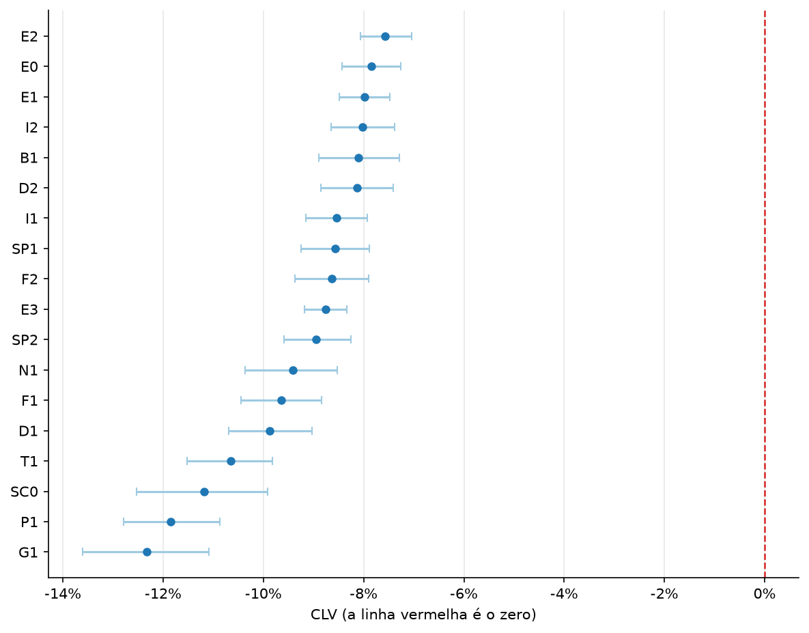
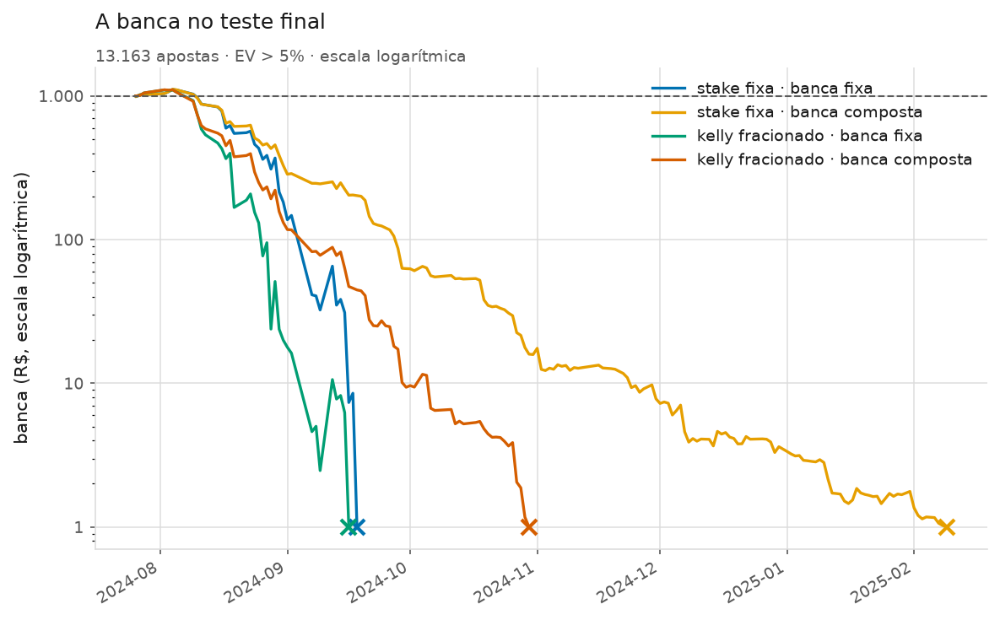

# Teste final — o cofre aberto

*Gerado em 21/09/2026 por `python scripts/teste_final.py`.*

Este relatório é o fim da linha do projeto. As temporadas que ele mede estiveram
trancadas desde a Fase 1: nenhum modelo as viu, nenhum parâmetro foi escolhido
olhando para elas, nenhum backtest as usou. Elas foram abertas **uma vez**, com
a configuração registrada antes, para responder uma pergunta:

> O que este projeto vinha afirmando se sustenta em dados que ele nunca tocou?

**Janela:** 24.779 jogos entre 2024-01-25 e 2026-06-02 (2024, 2024/25, 2025, 2025/26); 2.280 seguem trancados (temporada em andamento).

**O que continua trancado:** 2.280 jogos das
temporadas em andamento (2026, 2026/27). Temporada incompleta não é amostra de
temporada, e o cofre foi desenhado mais largo que o teste de propósito.

## O veredito

| # | Tipo | Critério (seção 8.4) |  | Medido |
|---|---|---|---|---|
| 1 | primário | CLV médio positivo, com o intervalo de 95% inteiro acima de zero | ❌ | -9,02% (IC -9,18% a -8,85%, 13.163 apostas) |
| 2 | primário | Consistência em mais de uma liga e mais de uma temporada | ❌ | CLV positivo em 0 de 18 ligas com ao menos 100 apostas e em 0 de 2 temporadas |
| 3 | primário | Configuração pré-registrada antes de abrir o teste final | ✅ | fechada em 21/09/2026, congelada em `avaliacao.teste_final.CONFIGURACAO` e conferida contra o `config.yaml` antes da leitura |
| 4 | secundário | ROI positivo, com o intervalo de 95% inteiro acima de zero | ❌ | -14,41% (IC -17,00% a -11,80%) |
| 5 | secundário | Pelo menos 5.000 apostas simuladas | ✅ | 13.163 apostas |

**O modelo não tem vantagem demonstrável sobre as casas.** Falhou os critérios primários 1 e 2 da seção 8.4, e a regra do projeto é explícita: se qualquer primário falhar, a conclusão é essa.

⚠️ **Esta tabela é o resultado do projeto, e ela não se renegocia.** Se algum
número mais abaixo parecer melhor que o da linha pré-registrada, ele **não**
substitui o veredito: escolher a linha depois de ver qual saiu melhor é
exatamente o que o pré-registro existe para impedir.

## A resposta em números

| | Valor | IC 95% | Apostas |
|---|---|---|---|
| **CLV** (critério primário) | **-9,02%** | -9,18% a -8,85% | 13.163 |
| **ROI** | **-14,41%** | -17,00% a -11,80% | 13.163 |
| CLV bruto (odd pega ÷ odd de fechamento − 1) | -0,20% | — | 13.163 |
| Taxa de acerto | 30,4% | — | odd média 3,80 |

**A régua, sem a qual esses números não se leem.** Apostar em **todas** as
65.715 candidatas — sem modelo nenhum, sem filtro — daria
ROI de -7,41% e CLV de -7,25%. O filtro de EV do
modelo entregou -14,41%, ou seja **-7,00%** em relação a
apostar sem pensar.

O menor efeito que esta amostra conseguiria detectar é
2,60% no ROI e 0,171%
no CLV. É por isso que o CLV é o critério primário: ele enxerga um efeito
15 vezes menor que o ROI,
na mesma amostra.

## O que estava registrado antes de abrir

Congelado em `src/futebol/avaliacao/teste_final.py` e conferido contra o
`config.yaml` **antes** da primeira leitura de temporada trancada. O commit que
traz essas constantes antecede, no histórico do Git, o commit que traz este
relatório — e essa ordem é a única testemunha possível, porque o `CLAUDE.md`
deste projeto não é versionado.

| O quê | Valor |
|---|---|
| Modelo | Dixon-Coles, `xi = 0.003`, `m = 6`, fator casa por liga |
| Mercados | 1X2 (mandante, empate, visitante) + Over/Under 2,5 |
| Odd da aposta | **média pré-jogo** — nunca a máxima (regra 8) |
| Odd do CLV | fechamento, margem removida pelo método `power` |
| Limite de EV | **5%** |
| Stake | fixa, 1% da banca |
| Banca | fixa (a composta aparece ao lado) |
| Ligas | as 18 aprovadas pelo filtro da Fase 2 |
| Configurações testadas antes | **108** |

⚠️ **O limite de EV registrado é 5%, e o projeto já sabia que era o pior dos
quatro que a Fase 6 mediu.** Registrá-lo assim mesmo é o ponto: a alternativa
seria abrir o cofre, olhar os quatro e escolher o que saiu melhor — que é
seleção por ROI, o que a regra 9 proíbe, e que produziria um número sem
significado.

## De onde as apostas saíram

Jogo sem odd não é um jogo sorteado ao acaso — costuma ser time pequeno, jogo
adiado ou liga menor —, então quantos ficaram de fora e por quê precisa estar
escrito (regra 13).

| | Jogos |
|---|---|
| Previstos pelo walk-forward nas ligas aprovadas | 13.143 |
| Com a odd pré-jogo de 1X2 completa | 13.143 |
| Sem odd pré-jogo (fora) | 0 |
| Sem a dupla de Over/Under | 0 |
| Sem odd de fechamento (não dá para medir CLV) | 0 |
| Fora por serem do Grupo 2 (regra 12) | 9.452 |
| Fora por liga reprovada na Fase 2 | 2.184 |

**Ligas que entraram (18):** B1, D1, D2, E0, E1, E2, E3, F1, F2, G1, I1, I2, N1, P1, SC0, SP1, SP2, T1.

## O modelo contra o mercado, fora da amostra

Antes de qualquer conta de dinheiro: o modelo prevê melhor ou pior que as odds,
em dados que ele nunca viu?

| Quem prevê | Jogos | Log loss | Brier | Acurácia | Calibração (ECE) |
|---|---|---|---|---|---|
| dc-xi-0.003 | 24.698 | 1,0240 | 0,6141 | 48,8% | 0,0051 |
| mercado (fechamento) | 24.698 | 1,0028 | 0,5997 | 50,4% | 0,0022 |

**Distância: 0,0212 de log loss.** Na validação (Fase 5,
36.413 jogos) essa distância era 0,0226. Se o número aqui for parecido, é a
notícia mais importante do relatório depois do veredito: significa que o modelo
**não piorou** fora da amostra — ele é consistentemente o que sempre foi, e o
que ele sempre foi é pior que o mercado.

Uma distância muito **menor** aqui mereceria desconfiança, não comemoração: a
primeira hipótese seria vazamento, não talento.

## O CLV, que é o critério que decide

O CLV compara a odd que se pegou com a odd de fechamento. Ele **não depende do
resultado do jogo**, então a variância por aposta é uma ordem de grandeza menor
que a do ROI — e ele converge com centenas de apostas, não dezenas de milhares.
Na escala deste projeto é o único sinal de vantagem que dá para medir de
verdade, e por isso a seção 8.3 o promoveu a critério primário.

Ele é reportado de duas formas, e as duas são necessárias:

| Forma | Valor | O que diz |
|---|---|---|
| **CLV justo** (decide) | **-9,02%** | odd pega × probabilidade justa do fechamento − 1 |
| CLV bruto | -0,20% | odd pega ÷ odd de fechamento − 1 |

O **bruto** responde "o modelo antecipa o movimento da linha?". O **justo**
responde "o preço que ele pegou era bom?" — e a diferença entre os dois é
exatamente a comissão da casa, que o preço de balcão sempre carregou.

**E é por isso que ele decide.** Com a volatilidade medida nesta amostra,
bastariam **4 apostas** para um CLV do tamanho
do observado aparecer com significância — contra
**430** para o ROI observado. Os dois números são
pequenos porque os dois efeitos são **grandes**; o que eles comparam é o poder
das duas réguas, e o CLV é ordens de grandeza mais sensível.

## Liga a liga

Uma média geral pode esconder que tudo veio de uma liga só. O critério 2 da
seção 8.4 — "CLV positivo na maioria das ligas com amostra suficiente" — só pode
ser conferido aqui.

| Liga | Apostas | ROI | CLV | menor CLV detectável |
|---|---|---|---|---|
| E2 | 993 | -14,29% | -7,57% | 0,49% |
| E0 | 965 | -4,97% | -7,84% | 0,58% |
| E1 | 1.086 | -9,48% | -7,99% | 0,50% |
| I2 | 654 | -16,33% | -8,02% | 0,63% |
| B1 | 598 | -12,55% | -8,10% | 0,79% |
| D2 | 530 | -13,40% | -8,13% | 0,71% |
| I1 | 904 | -16,90% | -8,53% | 0,61% |
| SP1 | 799 | -13,02% | -8,57% | 0,69% |
| F2 | 609 | -16,77% | -8,64% | 0,72% |
| E3 | 1.045 | -12,27% | -8,75% | 0,42% |
| SP2 | 840 | -16,28% | -8,94% | 0,69% |
| N1 | 606 | -10,68% | -9,41% | 0,92% |
| F1 | 698 | -14,40% | -9,64% | 0,80% |
| D1 | 606 | -29,31% | -9,88% | 0,83% |
| T1 | 688 | -20,62% | -10,65% | 0,89% |
| SC0 | 364 | -7,06% | -11,18% | 1,32% |
| P1 | 629 | -25,69% | -11,84% | 0,98% |
| G1 | 549 | -9,94% | -12,33% | 1,23% |

Ligas com menos de 100 apostas ficam de fora da tabela.
**CLV positivo em 0 de 18** ligas listadas.

**Tirando a melhor liga (E2):** CLV -9,13%
(IC -9,31% a -8,95%) em 12.170 apostas. A seção
8.4 exige esta linha: se o resultado sumisse ao tirar a melhor liga, era sorte.
Com 18 ligas, a melhor delas parece boa por acaso com facilidade.

## Temporada a temporada

A outra metade do critério 2. Um resultado que aparece numa temporada e some na
seguinte é ruído com sorte de calendário.

| Temporada | Apostas | Acerto | ROI | CLV |
|---|---|---|---|---|
| 2024/25 | 7.049 | 30,7% | -13,24% | -8,45% |
| 2025/26 | 6.114 | 30,1% | -15,75% | -9,67% |

## Por mercado

Onde o filtro de EV levou as apostas. A Fase 6 mediu que ele empurra para o
azarão, que é onde a casa cobra mais caro — esta tabela diz se isso se repetiu
fora da amostra.

| Seleção | Apostas | Odd média | ROI | CLV |
|---|---|---|---|---|
| vitória do mandante | 3.204 | 3,64 | -15,59% | -8,26% |
| empate | 1.620 | 4,99 | -7,34% | -11,27% |
| vitória do visitante | 4.122 | 5,27 | -21,75% | -11,11% |
| mais de 2,5 gols | 1.597 | 1,97 | -8,13% | -6,34% |
| menos de 2,5 gols | 2.620 | 2,07 | -9,60% | -6,88% |

## O que aconteceria com o dinheiro

⚠️ **Esta seção mede a política de dinheiro, não o modelo.** O ROI por unidade
apostada, lá em cima, é que mede a qualidade das escolhas. Uma banca que quebra
com um modelo vencedor é possível (basta apostar demais por dia), e uma que
sobrevive com um perdedor também. As duas coisas precisam ser lidas separadas.

| Estratégia | Banca final | Pior queda | Dias racionados | Quebrou? |
|---|---|---|---|---|
| stake fixa · banca fixa | R$ 0,00 | 100,0% | 11 | sim |
| stake fixa · banca composta | R$ 0,00 | 100,0% | 5 | não |
| kelly fracionado · banca fixa | R$ 0,00 | 100,0% | 24 | sim |
| kelly fracionado · banca composta | R$ 0,00 | 100,0% | 95 | não |

A banca pré-registrada é a **stake fixa com banca fixa**. As outras três estão
aqui porque a Fase 6 as reportou, e omiti-las agora seria escolher o que mostrar
depois de ver o resultado.

⚠️ **"Banca final R$ 0,00" com "quebrou: não" não é contradição.** Na banca
composta cada aposta é uma fração do que sobrou, então ela se aproxima do zero
sem nunca chegar: o valor arredonda para R$ 0,00 e a banca segue tecnicamente
viva. É a razão de a coluna "quebrou" existir separada do valor — e de a banca
final ser guardada direto, nunca recalculada como `inicial + lucro`, que em
ponto flutuante apagaria a diferença entre "sobrou um centésimo de centavo" e
"acabou".

## O que este teste não diz

Um relatório final honesto precisa marcar os limites do que mediu.

- **Não diz que o modelo é ruim em previsão.** Ele diz que o modelo é pior que o
  mercado, que é coisa diferente. O mercado é um agregador de milhares de
  apostadores com informação que este projeto não tem — escalação, lesão,
  motivação, dinheiro grande. Ficar a 0,0212
  de log loss dele, com placar e nada mais, é um resultado respeitável.
- **Não diz que nenhuma estratégia de aposta funciona.** Diz que **esta**, com
  este modelo, nestas ligas, nestes mercados e neste período, não funcionou.
- **Não mede o que não tem amostra.** O menor efeito detectável aqui é
  2,60% no ROI. Uma vantagem real menor que isso
  existiria sem aparecer — e é por isso que o relatório nunca escreve "não
  existe vantagem", e sim "não há vantagem demonstrável".
- **Não vale para odds máximas.** Tudo aqui é na odd média pré-jogo (regra 8).
  Quem consegue sistematicamente a melhor odd entre vinte casas está jogando
  outro jogo — e é justamente assim que quase todo backtest amador produz lucro
  no papel.

## Conclusão

**O modelo não tem vantagem demonstrável sobre as casas.** Falhou os critérios primários 1 e 2 da seção 8.4, e a regra do projeto é explícita: se qualquer primário falhar, a conclusão é essa.

**E isso não é o fracasso do projeto — é o produto dele.** O que foi construído
aqui é a máquina de não se enganar: o cofre que impediu o modelo de ver o teste,
o pré-registro que impediu a configuração de ser escolhida depois, o intervalo
de confiança em cada número, a régua de "apostar em tudo" que impede um ROI
ruim de parecer bom, e a regra de escolher modelo por log loss e nunca por
lucro. Qualquer um desses pedaços ausente produziria, com os mesmos dados, um
relatório animador e falso.

Havia caminhos fáceis para um resultado bonito: usar a odd máxima, varrer
parâmetros até o backtest fechar no azul, escolher a liga e o período que deram
certo, ou simplesmente não separar um teste final. Nenhum foi tomado, e o preço
disso é esta conclusão.
